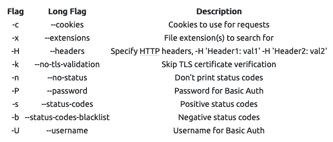
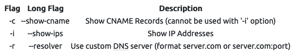

# Gobuster
List all the "path"/"directory"/subdomains under a website.
Gobuster is written in [Go](https://go.dev/)
Installation: `sudo apt install gobuster`

Useful flags: [More Here](https://github.com/OJ/gobuster#dir-mode-options)

Subdomanins:

Listing: `gobuster dir`
Example command 1 (files and directory): `gobuster dir -u http://10.10.10.10 -w /usr/share/wordlists/dirbuster/directory-list-2.3-medium.txt`
Example command 2 (files and directory with restriction): `gobuster dir -u http://10.10.252.123/myfolder -w /usr/share/wordlists/dirbuster/directory-list-2.3-medium.txt -x.html,.css,.js`

Subdomains: `gobuster dns` , check subdomains against DNS
Example command: `gobuster dns -d mydomain.thm -w /usr/share/wordlists/SecLists/Discovery/DNS/subdomains-top1million-5000.txt`

subdomains: brute-force virtual hosts: `gobuster vhost`, check subdomains against hosts (usually identifying the hidden subdomains)
Example command: `gobuster vhost -u http://example.com -w /usr/share/wordlists/SecLists/Discovery/DNS/subdomains-top1million-5000.txt`
* If this is the subdomain of other top domains