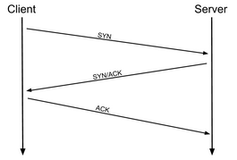

# Nmap

Enumeration tool to scan the available port and services

# Command

`nmap -h` or `man nmap` man page

## Scanning

Close port should obey to [RFC 9293](https://datatracker.ietf.org/doc/html/rfc9293) when a closed port should send back a RST packet

Switch starts with `s`  
`-sT` TCP Connect Scans, send a full three way hand shake
`-sS` SYN "Half-open" Scans, only send syn to server
`-sU` UDP scan (If the port is open, there should be no responses)

`-o` OS scan  
`-sv` detect service version  
`-A` shorthand switch that activates service detection, operating system detection, a traceroute and common script scanning

### Less common scan
This are generally used for firewall evasion, avoid firewall detection
`-sN` TCP Null Scans  
`-sF` TCP FIN Scans  
`-sX` TCP Xmas Scans
* If the port is open, there should be no responses

## Scan Port
`-p [port number (range)]` scan specified port  
`-p-` scan all port
### Bypass firewall
`-Pn` bypass the ICMP block, always treat target alive
it is preferable to use ARP requests if on the local network
[More filewall evasion techniques](https://nmap.org/book/man-bypass-firewalls-ids.html)
#### Packet sending techniques
`-f` use fragment packet
`--mtu <number>` provide more control over the size of the packet (must be a multiple of 8)
`--scan-delay <time>ms` delay between packets sent
`--badsum`:- this is used to generate in invalid checksum for packets. Any real TCP/IP stack would drop this packet, however, firewalls may potentially respond automatically, without bothering to check the checksum of the packet. As such, this switch can be used to determine the presence of a firewall/IDS.

## Scan network
use ICMP to detect if the machine is online
`-sn`  
`nmap -sn 192.168.0.1-254`
`nmap -sn 192.168.0.0/24`

## Verbose
`-v` first level verbosity  
`-vv` second level verbosity

## Output
Switch starts with `o`  
`-oA` save the nmap results in three major formats  
`-oN` normal format  
`-oG` grepable format

## Peripheral
`-T5` timing template to level 5  
`--script=[script category]`

# Nmap Scripting Engine (NSE)
- Addition to Nmap
- Extending its functionality
- Written in the Lua programming language
- Script library and its category
    `safe`: Won't affect the target
    `intrusive`: Not safe: likely to affect the target
    `vuln`: Scan for vulnerabilities
    `exploit`: Attempt to exploit a vulnerability
    `auth`: Attempt to bypass authentication for running services (e.g. Log into an FTP server anonymously)
    `brute`: Attempt to bruteforce credentials for running services
    `discovery`: Attempt to query running services for further information about the network (e.g. query an SNMP server).
	[More able NSE](https://nmap.org/book/nse-usage.html)
	
### NSE usage
- NSE is activated with `--script=[category]`
	e.g. `--script=vuln` `--script=http-fileupload-exploiter` `--script=smb-enum-users,smb-enum-shares`
	e.g. `nmap -p 80 --script http-put --script-args http-put.url='/dav/shell.php',http-put.file='./shell.php'`
- **Help command** `nmap --script-help <script-name>`
	- Note that to know what the argument is, click in to the link that shows more information
- Note that the arguments are separated by commas, and connected to the corresponding script with periods.

###  Searching for script: 
- Read Doc: [Nmap website Doc page](https://nmap.org/nsedoc/)
- Script are stored under `/usr/share/nmap/scripts`
- Search using `/usr/share/nmap/scripts/script.db` which has formatted text file containing filenames and categories for each available script
	- grep search: `grep "ftp" /usr/share/nmap/scripts/script.db`
	- category search: `grep "safe" /usr/share/nmap/scripts/script.db`
	- directory expression search: `ls -l /usr/share/nmap/scripts/*ftp*`

### Installing new script
- If missing script: update nmap will fix it
	- `sudo apt update && sudo apt install nmap`
- Download script from nmap `sudo wget -O /usr/share/nmap/scripts/<script-name>.nse https://svn.nmap.org/nmap/scripts/<script-name>.nse`
- Update `script.db` using `nmap --script-updatedb`
- same update process if writing my own script