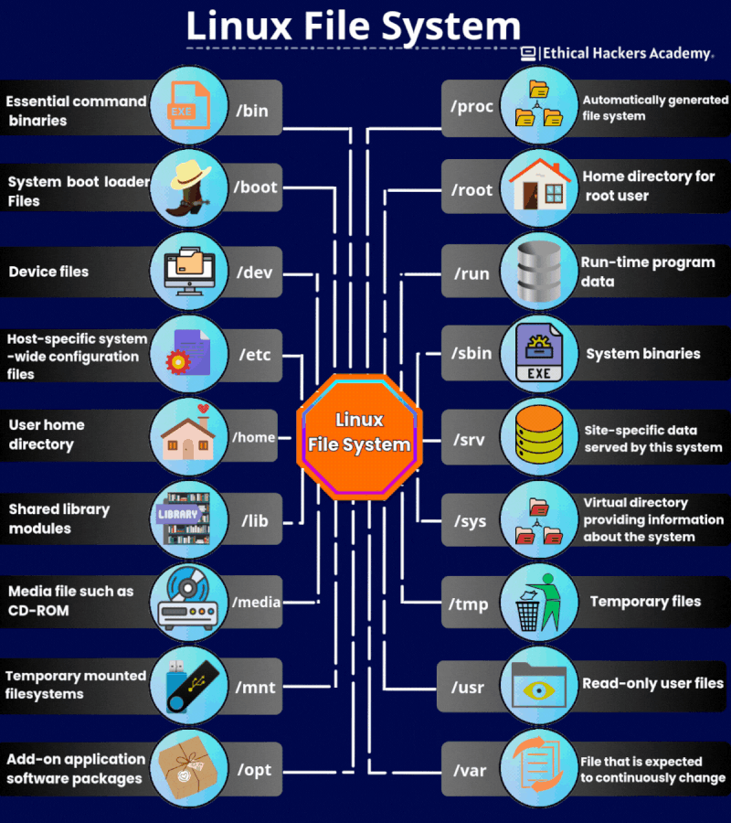
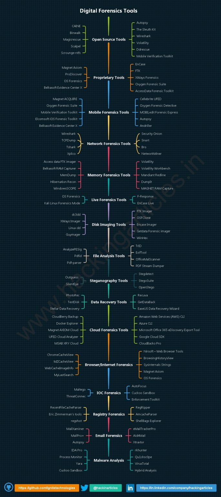
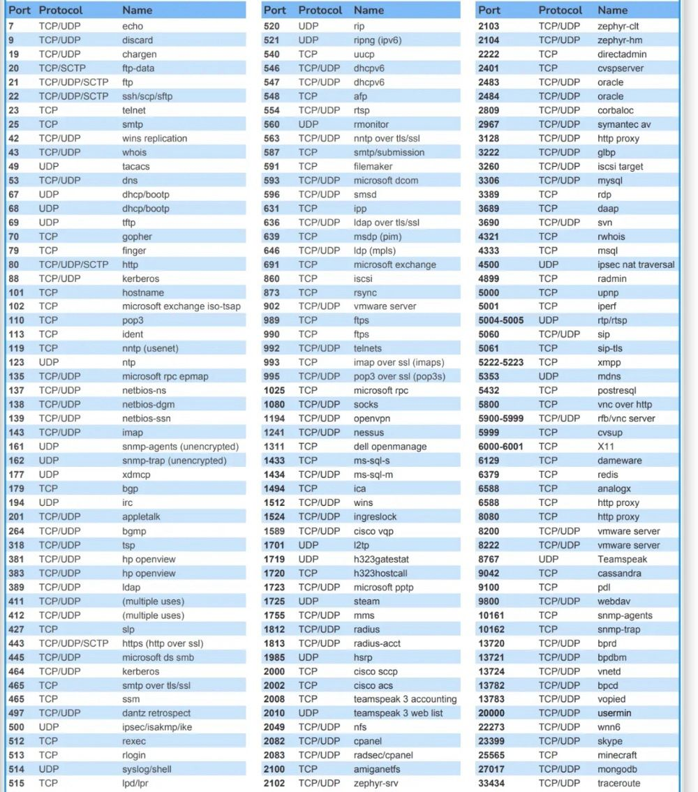

# General & Resources

## Tools
[Google Dorking](https://gist.github.com/ikuamike/c2611b171d64b823c1c1956129cbc055)

## Man Page
`man [command name]`
search in the man page:
`man ssh | grep -e "version number"`

## CVE Research
- [ExploitBD](https://www.exploit-db.com/) 
	- Exploit to be downloaded
	- Linux: searchsploit
- [NVD](https://nvd.nist.gov/vuln/search) 
	- Keep all common CVE available
- [CVE Mitre](https://cve.mitre.org/)
- [CVEDetails](https://www.cvedetails.com/)
***CVE format: CVE-YEAR-IDNUMBER**: e.g. CVE-2018-16763

## Blog

- [OSCP guide v1](https://johnjhacking.com/blog/the-oscp-preperation-guide-2020/)
- [OSCP guide v2](https://johnjhacking.com/blog/oscp-reborn-2023/)
- [Malware Note from qwqdanchun (Chinese)](https://docs.qwqdanchun.com)

## Resources
- [Github preset wordlists](https://github.com/danielmiessler/SecLists)
- [ffuf Command](https://github.com/ffuf/ffuf)
- Hash cracker: [crack the hash](https://crackstation.net/)

## Github
- [LinEnum](https://github.com/rebootuser/LinEnum/blob/master/LinEnum.sh)

# __Cybersec Resources

## Useful Website
1. VirusTotal: https://www.virustotal.com
-For analyzing files and URLs

2. CVE (Common Vulnerabilities and Exposures): https://www.cve.mitre.org
- For identifying known vulnerabilities and threats.

3. WHOIS: https://lnkd.in/gMqJ-qvT
-For investigating suspicious domains and identifying ownership.

4. Shodan: shodan.io
- For discovering exposed internet-connected devices. 

5. AlienVault OTX: https://lnkd.in/gbFijfFZ
-For sharing threat intelligence. 

6. Nmap:https: //www.nmap.org
-For network discovery and scanning.

7. Censys: https://www.censys.io
-For monitoring and discovering vulnerable devices/services.

8. Exploit Database: https://www.exploit-db.com
-For exploits and vulnerabilities/CVEs.

9. DNSDumpster: https://lnkd.in/gDMZx5WD
-For domain research 

10. OSINT Framework: https://lnkd.in/giwxHNaY
-A collection of free tools!!!

11. Metasploit Framework (Community Edition): https://www.metasploit.com
-For penetration testing

12. Iplocation: https://lnkd.in/gaQpGjwY
-For IP address information

## Linux File System

## Digital Forensics

## Port Number

