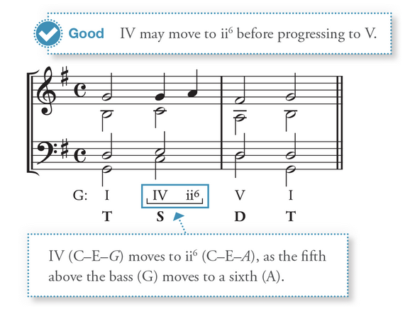
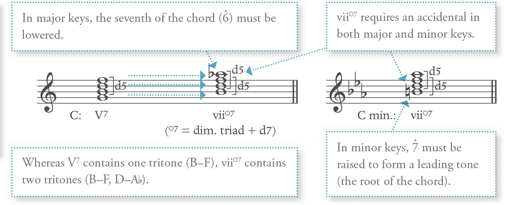
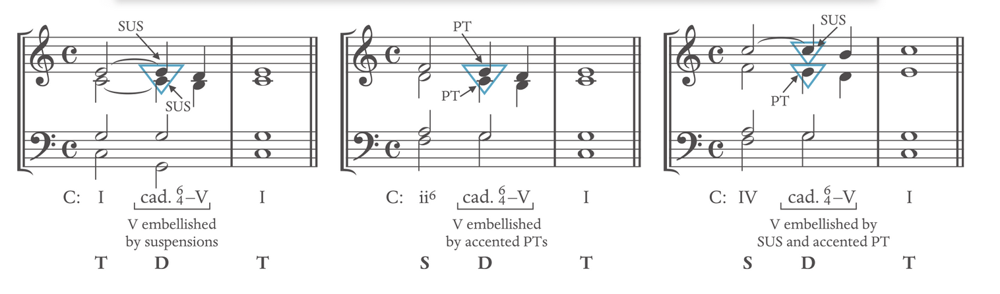
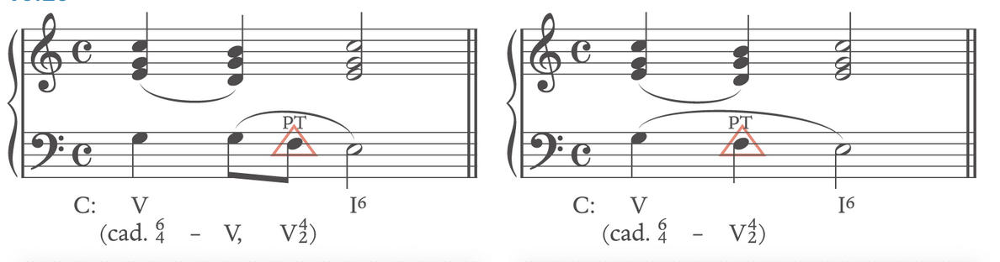
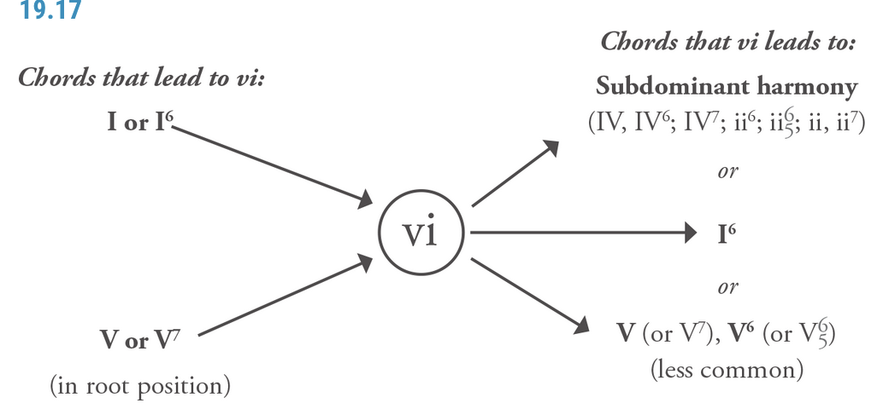

# Chord Function

==**All chord must contain the root and the 3rd**\*\*==  
==**Classic Music: All the chord should abide to the harmony restriction rules**==  
==**The way that they are categorized into TSDT because they have a share common tone**==  
==**Anything that are not TSDT are called **Harmonic prolongation****==  
==**Do not raise the leading tone when it's not part of a dominant function**\*\*==

# Harmonic prolongation

**Harmonic prolongation**: stretch out of a particular harmonic function.

- Same function Chord i.e. T-T-T S-S-S, D-D-D
- The sandwich: alternating a chord i.e. I-IV-I
- mini TSDT: a short TSDT as a Tonic

# Tonic Chord

### I:

Provide stability  
Best to **double the root**. **Double the fifth/third** is also possible  
The **upper part** (soprano, alto, tenor) **stays** or is moved to the **nearest chord tone**.

### I6:

Less stable  
Any note can be doubled  
Extension/alternate/substitute of I chord  
**Can NOT be served as AC** (authentic cadence)  
Used as **evaded cadence** (when expecting I for cadence, but used I6)  
Watch out for parallel octaves  
**Avoid V7 - I6 progression**

### I64:

See Cadential V64

# Subdominant Chord

==**(all voices should move in contrary to the bass to avoid parallel)**==

## VI can also be subdominant Chord

## ii6(5) and IV Major

<ins>**IV: Double the root (4̂)**</ins>  
<ins>**ii6: Double the root (4̂) or the bass (2̂)**</ins>  
**ii6 or ii65 can embellish I or I6**, but are **usually avoided** in basic harmony exercises.  
**Note that 6̂ is semi-tone lower than major**  
**Leads** effectively to a **root position dominant chord AC or HC**; Especially effective with i6\-D-T chord  
Never in a D-S order (except in special circumstances)  
**IV-ii6 shares so many notes**. This chord essentially represents an elaboration of a single harmony. **IV: 461, ii6: 246, 1->2**: The melody note  

## ii°6, iiØ65, iv Minor - see Major with the following restriction

In a **minor key**, **6̂ tends to pull down to 5̂**  
**6̂-7̂ in minor created A2**, exotic and should be avoided  
**Avoid doubling 6̂**  
**Raise 6̂ if 6̂-7̂** as in the ascending melodic minor -> **raise 6̂ change the quality of the chord**: turns them into the major version of the chord ii6, ii65, IV

## IV(6) - lead to dominant

**Phrygian cadence: iv6-V in the minor**  
If the **bass or melodic line ascent from 6̂ to 7̂**, **raise the 6̂** accordingly  
Mostly used with a stepwise motion in the bass

## ii (Avoid ii°) - lead to dominant

Avoid using ii° in minor (it sounds harsh)  
**Double the root of ii triad**  
ii° is often found in sequence

## IV7, ii7 lead to dominant

**IV7 and ii7 can appear in any inversion**  
ii7 is usually used with ii65  
IV7 is usually used with its root/first position  
The **voice-leading problem in S-D** can be **avoided by a large leap in the middle voice** or inserting cadential 64

## ii6(5), IV(7) (and their minor) - Lead to Tonic

**Embellishing the tonic harmony**: It can be sandwiched by the Tonic chord: **I - IV - I**  
**Typically 1̂ sustained** and **other moves in neighbour tone**  
Can form **Plagal Cadence**: IV-I motion  
**Most common melody** used with the **sandwich chord**: **3̂-4̂-3̂, 5̂-6̂-5̂, 1̂-1̂-1̂**  
**IV6 appears** in between IV and I: **where IV arpeggiates up to I**: Ie.g. I-IV-IV6\-I.  
Note that I-IV6\-I is NOT a normal progression  
Note that I-IV6\-I6 is a good progression  
**IV6 embellishes the tonic harmony**  
Just like IV: **ii6 or ii65 can embellish I or I6**, but are usually **avoided in basic harmony exercises**.  
Note that the **chordal seventh** of ii65 is not treated as dissonance but **sustained** to I

## Subdominant Alternation

When moving between subdominant chords, it is **typical for the root to move down by a third**, but it is possible to move up by a third. e.g. IV-ii is more common

# Dominant Chord

==**Do not raise the leading tone when it's not part of a dominant function**\*\*==

## V:

Best to **double the root**. Double the fifth is also possible  
The upper part (soprano, alto, tenor) stays or is moved to the nearest chord tone. **7̂ must be raised in minor**  
**Do not double the leading tone.**  
If the **leading tone** appears **in the outer voice**, it **must resolve up**: if in the inner voice, it does not.

## V6:

Functions like the V chord  
Typically in the middle of the phrase, it should **not be part of the cadence**  
Can have a problem of leaping into tritone

## V7:

**Should NOT be used as a Half Cadence (HC)**  
There are **two tendency tones**: Chordal seventh resolved down, and Leading tone resolves up.  
**Fifth must be omitted when the leading note appears at the top of a V7\-I progression** (or it creates a voice leading issue) - Always uses triple root.  
V-V7 is labelled as V8-7: INT (embellishing tone) may decorate the chordal seventh before resolving down.

## V65:

Often **embellishing a tonic harmony** as neighbour tone o**r incomplete neighbour tone**  
**Must lead to I**  
Usually none of the note is repeated or omitted

## V42:

Often **embellishing a tonic harmony** neighbour tone **or incomplete neighbour tone**  
**Must lead to I6**  
The chordal seventh is so prominent that V42 must not be followed by V7 or other root position V chord and always resolved to I6  
Usually none of the notes is repeated or omitted

## V43 or vii°6

Often **embellishing** a tonic harmony neighbour tone or passing tone **for I or between I6**  
**3̂-4̂-5̂ melody can be problematic, exceptions are made:**

- d5-P5 (**parallel**) is **fine with V43 to I6 only** (between 4 and 5)
- The **chordal seventh** of V43 **may move up by step**, V43 to I6 only (only in melody)

## vii°7:

  
contain two tritones and **always require an accidental**, no matter major or minor  
vii°7 and its inversion is **treated like any V7 inversion**, acts as embellishment  
**vii°42 is far less common because it leads to I64**  
**Voice leading with vii°7 should be mindful to avoid a parallel motion to a perfect fifth**  
**Major**: add a **flat to chordal seventh** of vii°7  
**Minor**: **raise the natural leading tone**  
vii°7 is a stronger dissonance compared to viiØ7

## viiØ7

**Exist only in the major key** and **does not require accidental**  
Functions much like vii°7  
It can be in root position or inversion  
Often used as a **substitute of the dominant chord**

## Cadential 64

64V is **dominant harmony**  
A combination of I64 and V/V7  
Can **follow subdominant**, **cannot follow a dominant** chord and **almost always followed by I**: 64-V-I  
The **embellishment** of cadential 64-V is **usually formed through Suspension, Passing tone or Suspension AND Passing tone**.  
  
Always **double the bass**  
The **fourth** is dissonance, **which should never be doubled** and **should solve down by step**. The only exception is when it moved to 2̂ (can move up by a step) in a complex situation.  
The **sixth** is not dissonance, **can move up/down**, usually down by a step  
It should **appear on a strong beat**  
(In triple meter, beat 2 is usually stronger than beat three especially when 64V is on beat 2)  
It **can be part of a half cadence or authentic cadence**  
Exception: if the bass of V42 is a passing note, then it is possible to do a V46-42. Mainly used as evading cadence  

# Multi-function of VI

  
**V-vi** substitutes the case of **V-I** progression  
**Deceptive cadence: V(7)-vi**  
**I-vi**: **double the root** and **voices move in contrary**: Descending by third frequently occurs. Ascending third is far less common  
**V(7)\-vi**: **double the third** in vi to solve the leading tone issue (possible to double the root of vi in the major key)  
VI6: **embellishing** Tonic chord in upper voice & used as part of **modulation**: VI6 should not be used in basic four-part harmony exercises.  
**Double the fifth creates a parallel fifth/eighth**

# Sequence Chord (See Sequence Section)

## iii or III

**Not often** used in **diatonic contexts** (where music stays within single keys)

**iii/III substitute for I6**. Root position shares two notes with I6. e.g. vi-I6-IV=vi-iii-IV, V-I6=V-iii

**Mostly are found in the sequence.**

The 7**̂ does not need to ascend to the tonic** and **not be raised in minor keys** if in the goal of substituting diatonic chords.

### Use cases:

More often found in the **change of key**:

- **Modulations**
- **Tonicizations**
- **Chromatic alternations**

**In diatonic situations**: they are mostly found in sequences

## iii6 or III+6 (Minor)

**iii6 or III+6 substitute for V**. Shares two notes with root V. It is usually **labelled as V with an embellishing tone**

*iii6 is often substituted for V in the late nineteenth-century music.*

**Relate to iii6**: V76, seventh chord + sixth replacing the fifth of V7

Should **NOT be used in basic harmony** exercise

## vii°

**Not common**, often **understood as V65** with the root removed

**Often found in sequence**

**Do NOT use it in four-part harmony**

## VII

Determine a minor key tonality

**hint change of key, often used to move to the relative major**

**Root is natural 7̂**

**Do NOT use it in four-part harmony**

## vii°64

**Understood and labelled as V42** (V42 without root)