# Chord Quality

## Triad Chord

**Diminished Triad** (end with a circle): the interval of the first and fifth is d5
(Perfect Triad) **Minor Triad** (m) : the interval of the first and fifth is P5: stacked with m3 and M3
(Perfect Triad) **Major Triad** (M): the interval of the first and fifth is P5: stacked with M3 and m3
**Augmented Triad** (+): the interval of the first and fifth is A5

## Chords Addition
The rule of **dissonance 7th** is the rule followed by the classical period

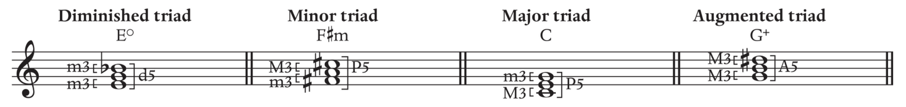

### Observation
**By looking at the Triad** (Stacking)
(-) Diminished Triad: Minor 3rd + Minor 3rd
(m) Minor Triad: Minor 3rd + Major 3rd
(M) Major Triad: Major 3rd + Minor 3rd
(+) Augmented Triad: Major 3rd + Major 3rd

**By looking at the 5th interval** (The most outside notes)
(+) Augmented chord: From perfect 5th to augmented 5th
(-) Diminished chord: From perfect 5th to diminished 5th
(M/m) Major/minor chord: Perfect 5th stays perfect 5th

Q. To write a given triad  (G#m)
Write natural triad
Match the root with accidental
Match the proper structure with accidental (m3+M3 and confirm P5)

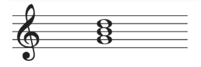
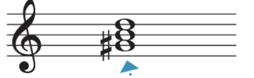
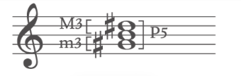

## Chord Inversion
The inversion is **solely based on the bass note** (the lowest note)
The **figure** is labeled based on the **distance** of **other note with the base** note:

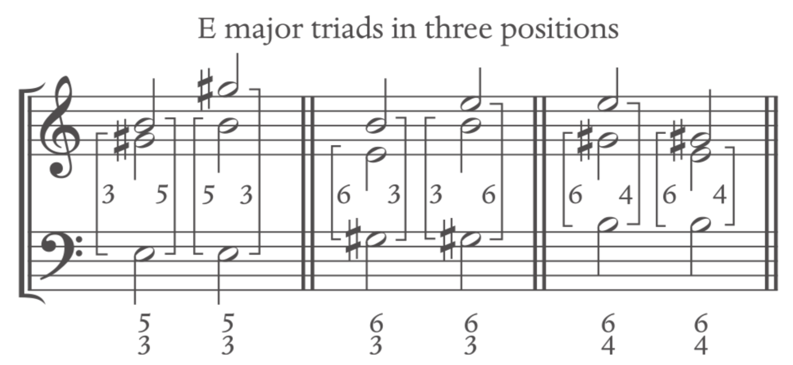

Roman numeral for any major key

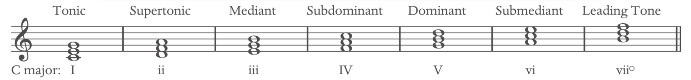

Roman numeral for any natural minor key

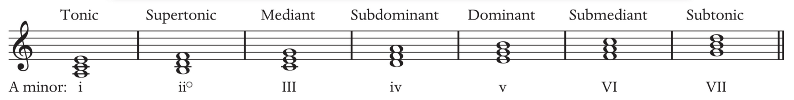

Note that the v and the VII chord are usually modified to be used with the raised 7 (harmonic minor scale), in which 
- v becomes V
- VII becomes vii°

## Seventh Chord

**From Stacking perspective**
**Fully Diminished**: diminished triad + minor third
**Half-Diminished**: diminished triad + major third
**Minor**: minor triad + major third
**Dominant**: major triad + minor third
**Major**: major triad + major third

**From the 7th interval perspective**
**Fully Diminished**: diminished triad + d7
**Half-Diminished**: diminished triad + m7
**Minor**: minor triad + m7
**Dominant**: major triad + m7
**Major**: major triad + M7

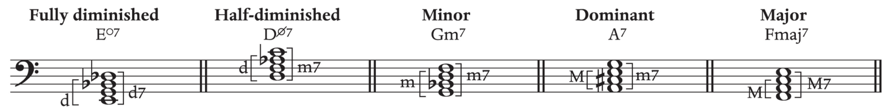

Q. To write a given seventh chord  (EbMaj7)
Write base seventh chord
Match the root
Add proper accidental to the triad and the seventh

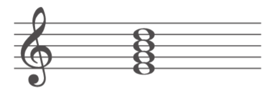
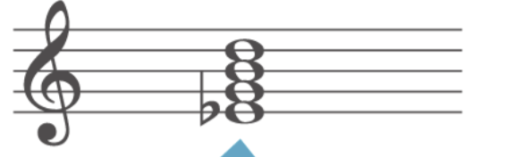
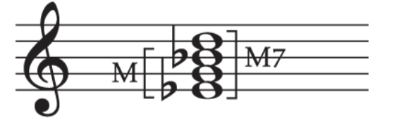

## Seventh Chord Inversion

Same as Triad, but with its accordance number figure

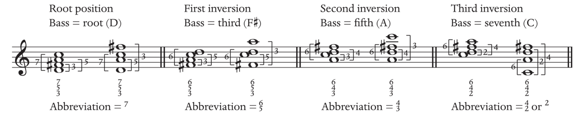

Note: the seventh chord are found more often built on 2, 4, 5, 7 than 1, 3, 6

The basic form of the chord
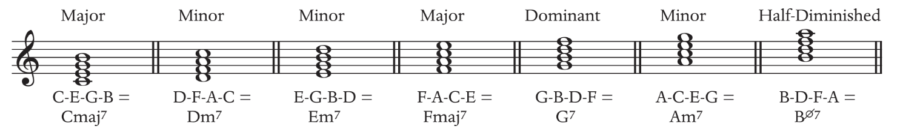

### Triad and Seventh chord comparison

Natural white key **Seventh Chord**
**Major Seventh Chord**:
I7	ii7	iii7	IV7	V7	vi7	viiØ7
**Natural Minor Seventh Chord**:
i7	iiØ7	III7	iv7	v7	VI7	VII7
**Harmonic Minor Seventh Chord**:
i7	iiØ7	III7	iv7	V7	VI7	vii°7

Natural white key **Triad Chord**
**Major Triad Chord**:
I	ii	iii	IV	V	vi	vii°
**Natural Minor Triad Chord**:
i	ii°	III	iv	v	VI	VII
**Harmonic Minor Triad Chord**:
i	ii°	III	iv	V	VI	vii°