# Embellishment

Also known as Elaborations, ornamentation, non-chord Tones, They are notes that doesn't belongs to the chord tone

## Embellishment review

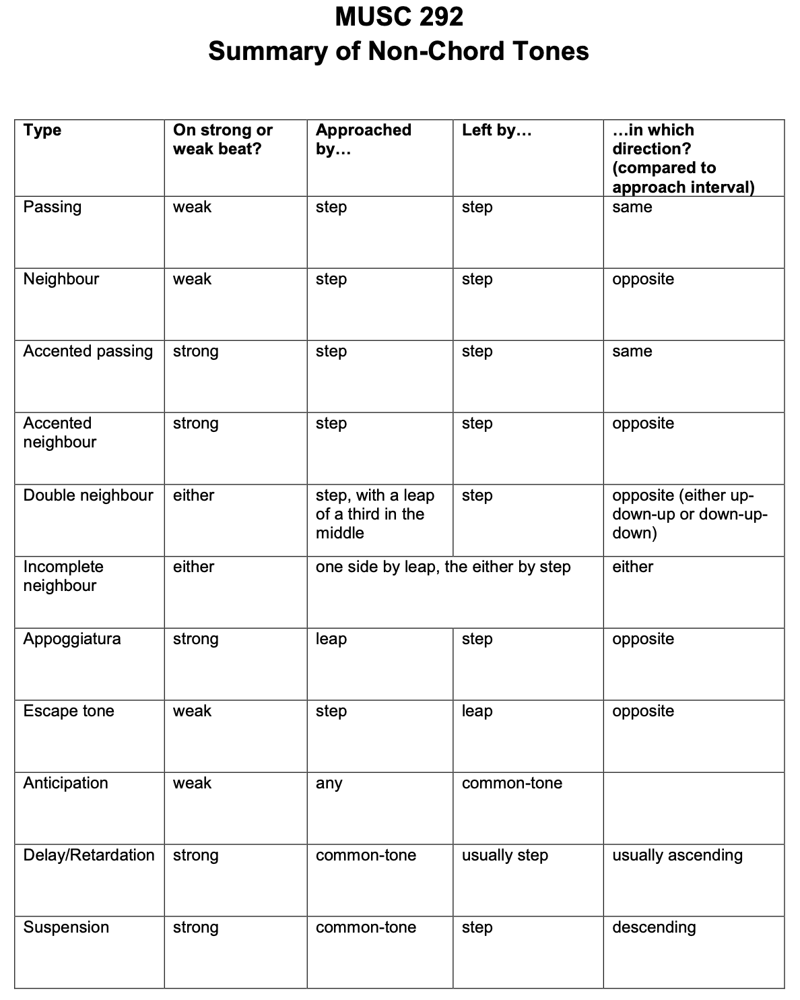

**Passing Tone**: may be accented or unaccented
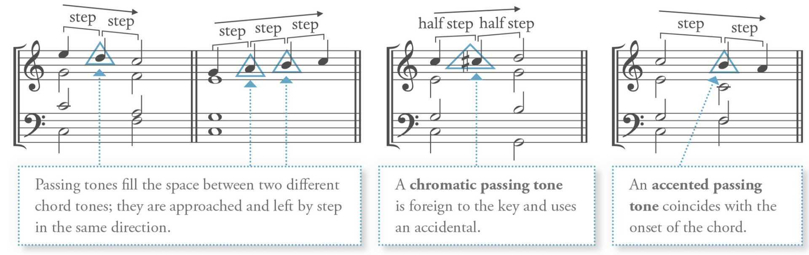

**Neighbour Tone**: may be accented or unaccented
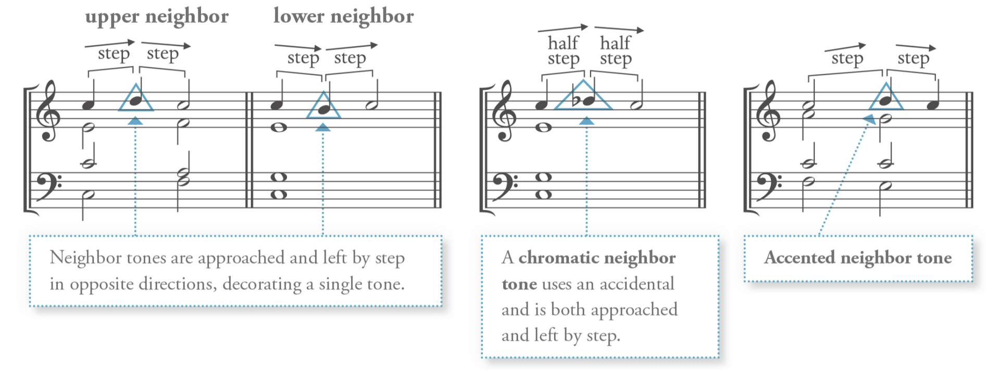

**Double Neighbour Tone**: two neibour tone move simultaneously
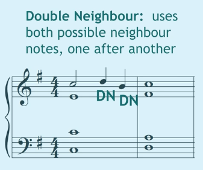

**Incomplete Neighbour Tone**: not mentioned, assumed can be both accented or unaccented
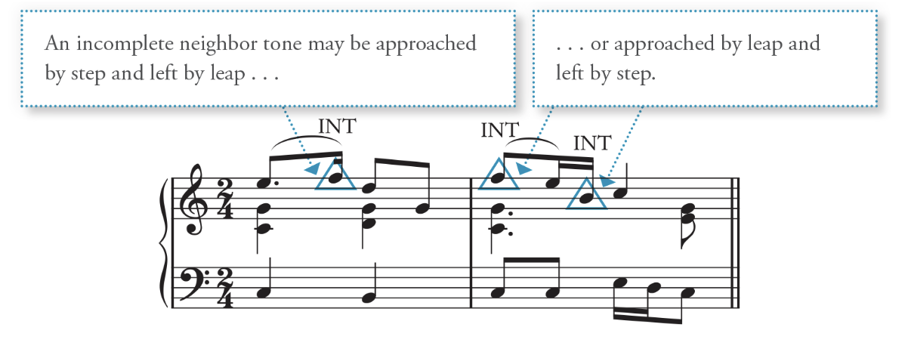

**Appoggiaturas**: (accented) Leave by leap and then opposite direction by step
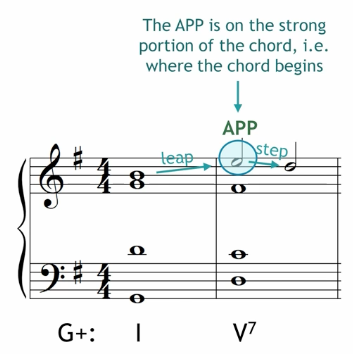

**Escape tone** (Echappee): (non-accented) move by step and leave in the opposite direction
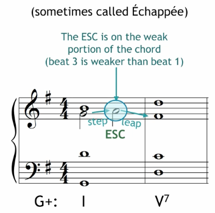

**Anticipation**: Approached and left by common tone, must be unaccented.
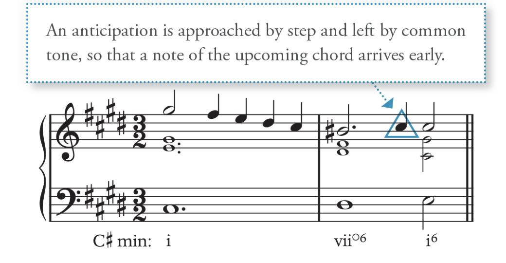

**Delay/Retardation**: A suspension that resolves up, must be accented.
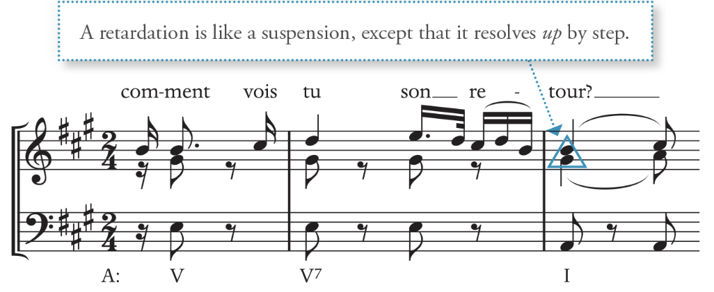

**Suspensions**: sustain a previous dissonant note and resolve down by step, must be accented.
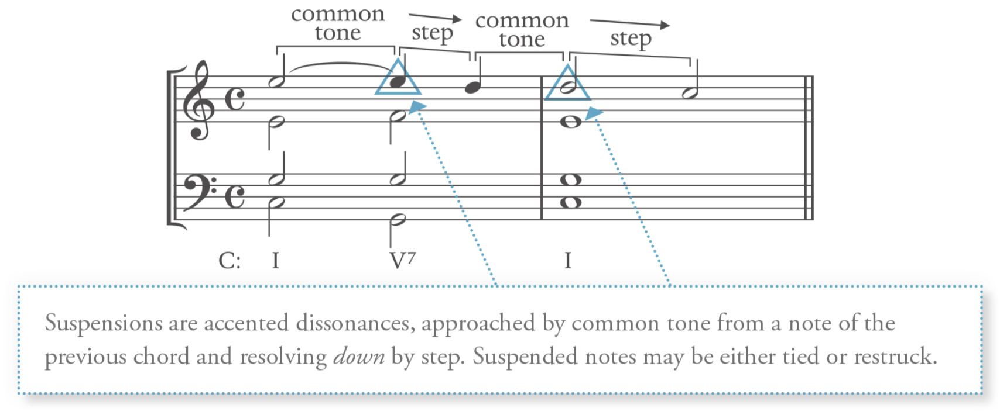

**Chordal Skip**: move to a different note in the current chord - **Very useful for a voice leading problem**
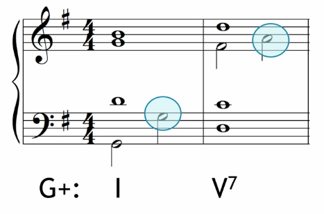

When saying a note is **accented** or **unaccented**, it means that if this note **appears along with other chords on the downbeat**. (At the start of a chord-strong beat/weaker part of the beat)

# When using them
- distribute evently throughout te voice
- Two or more simultaneous non-chord tones must be a consonance with one another.

# Embellishing Tone

## Adding Embellishing Tone
**Accented dissonance** (Special Rule): **Complete harmony can appear only with the embellishment tone**.

Do **NOT double** the note **that is being embellished** (create parallels)

The 2 in figure bass often leads to an accented dissonance

**9 as suspension** and **always resolve down**: It must **appear at least an octave above** the highest chord root: used in V9 in root position (rarely in inversion) -> V7 with an added ninth.

Sus 9 is an exception from the Complete harmony

### Other embellishing tones:
**I^64^**: See cadencial V^64^
**IV**: see lead to tonic, tonic embellishment
**VI^6^**: Embellishment of I

## Pedal Point
A **single sustained tone** (usually in the bass)

The **pedal point is decorated by the chord** that sounds above it
Used at the **beginning** or the **end**: often embellish a tonic or dominant chord

**Label the chord above the pedal point in its root position**

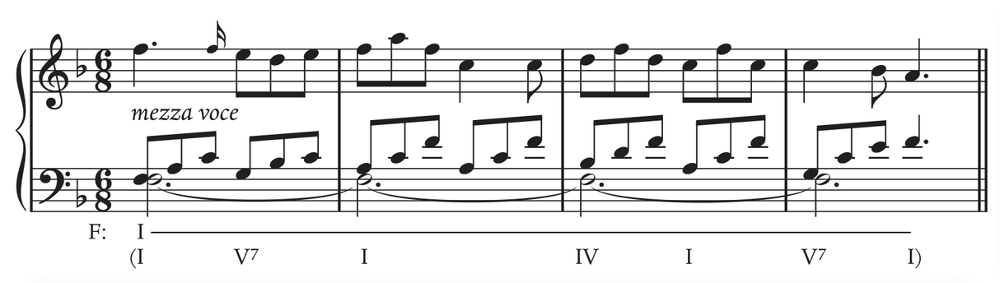

# Embellishing Harmonies with 64 Chord

Contain the **dissonant fourth** above the bass and **thus do not function like other chords**: When the fourth is presented in the upper voice, they are consonant. Any fourth made up with bass tone is dissonant. **Hence all 64 chords are dissonant**

64 (except cadential 64) **appears in weak beats**

The **64 are labelled by their specific function** in addition to their Roman numeral: pass 64, arp 64, etc.

64 chords **function differ from their root chord** 

The **bass is doubled** in all types of 64 chords.

## The 64 specific chord functions:

### Cadential 64: see cadential I64-V
Cadential 64 can be embellished with other 64 chords. The 64-53 combination also works with other chords

### Pedal 64:
A **sustained** bass tone
And the upper voice root position chords are decorated with embellished tones and stationary bass
Most often, **embellish either I or V**

### Passing 64:
A **passing bass** tone
Passing tone with 5̂ is extremely common

### Arpeggiated 64
Occurs when **upper voice chords are sustained**
Most often found in instrument genres

# Embellishing Harmonies

The **embellishing tone in the bass** form as a result of a **neighbour's tone or passing tones**

When Labelling the chord for every single embellishing tone, it all depends on the level of detail desired.

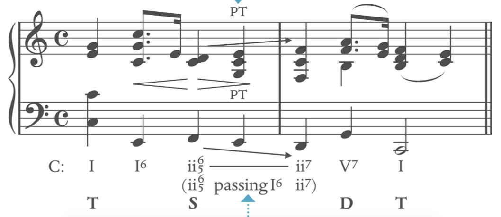

## Functional harmonic progressions
Where the function of the embilishment chord fits the current harmonie progression (Label them as normal harmony chords)

## Nonfunctional harmonic progressions
The embellishing function should be labelled in the case when chord does not have function a functional harmonic progressions

e.g. I-“ii^7^”-I^6^ is a non-functional harmonic. (ii^7^ embellished to I) the ii^7^ does not lead to V, and the chordal seventh does not resolve. The “passing function” should be explicitly noted in non-functional harmonic progressions.
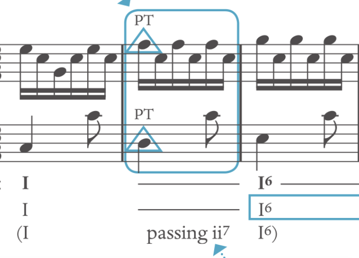

### Passing IV^6^ (ascending motion in the bass)
Extremely **common** in the stepwise **ascent** **in the bass between V^(7)^-V^6(5)^**

### Passing V6 (Descending motion in the bass)

Extremely **common** in the stepwise **descent** **in the bass between I-vi or IV^6^**
**V^6^-IV^6^ or V^6^-vi does not serve as dominant**, the **7̂ does not need to be raised**. Hence usually **appear as v^6^** in the minor triad

### Lament bass: Use half-step moving from I to V
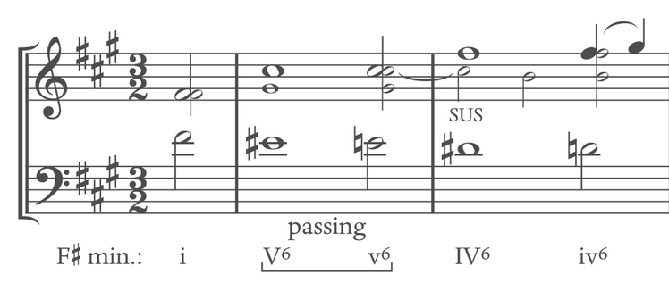

## Common Usage of passing IV^6^ and passing V^6^

By **using passing IV^6^ and passing V^6^**, we can easily **harmonize the scale in the bass in steps**.

Both **Passing V6 and Passing IV6** are very **useful when two dominant chords is sandwiched**.

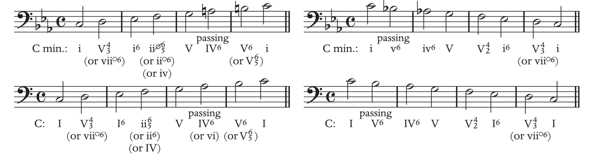
