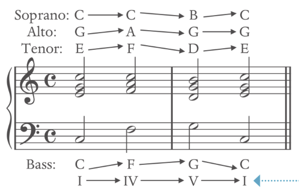
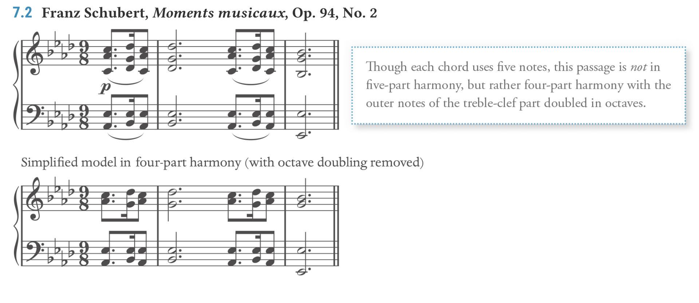
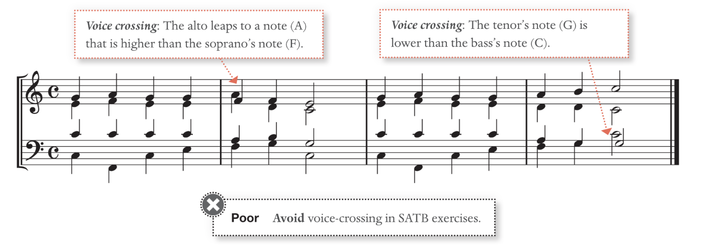
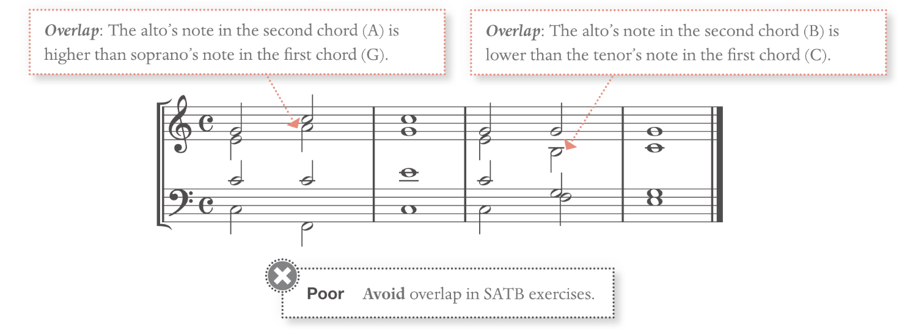

# Harmony Rules 

==**Do not raise the leading tone when it's not part of a dominant function****==
Melodic interval (when written horizontally):
==**not M7, m7 as melodic interval****==
==**Avoid tritone****==
==**no dim or aug intervals****==

From one chord to the other is called **harmonic progression** or **chord progression**.

**Voice Leading** refers to **each line within the chord progression**.
**Tendency tone** refer to notes that require special treatment

# Some common Rules

**Leaps between Chord**: the **max leap** is a distance of **perfect fourth**, **do not leap toward a dissonance**.

**Sustained chord leap**: Same chord are free to jump over different inversions; **Chord can jump to any of its inversions without restriction**

**The Seventh chord**:  cannot move to a triad, because the chordal seventh needs to resolve.

**Figure bass**: Do not add accidental unless stated in the figured bass

A complete T-S-D-T pattern chord includes all the notes from a scale in harmony

**Tonic to Subdominant chord**: should **always move in a contrary motion** to avoid parallel fifth or eighth

## Chord Omit Rule: 
**Seventh Chord**: The fifth from any (root chord) seventh chord may be omitted, but never omit the third

**Triad Chord**: The fifth may always be omitted, always keep the third, it creates a hollow sound otherwise. (Or pure tonal in a piece)

# Tendency Tone

## About Chordal Seventh

The Chordal seventh **could resolve in a different voice register**

Do **NOT downward** melodic **leap to Chordal seventh**.

**All chordal seventh need to resolve**. It can stay on the same note and be resolved later. 

## About Minor 6̂

The **6̂** have a strong tendency to **pull down to 5̂**

**Avoid doubling minor 6̂** in any cases

Minor 6̂ requires special treatment: can **raise the 6̂ when ascending** to avoid augmented 2nd if required.

After special treatment of **6̂, note their notation changes**. e.g. iv6 turns into IV6 

Note that when **descending** in a minor scale, the **6̂ and 7̂ do not need to be raised**. (Especially in the outer voice)

## Leading Tone

In the **inner voice** of the **major key**, the **7̂ can go down to 6̂**

In the inner voice of the **minor key**, the **7̂ must go to 1̂** to avoid augmented 2nd issue

**The leading tone that does not act as dominant does not need to be raised.**

Note that when **descending** in a minor scale, the **6̂ and 7̂ do not need to be raised**. (Especially in the outer voice)

**Applied leading tone** (in applied chords) **is also a leading tone**. Treat it as such

# Voice Leading

## The Outer Voice:

**Upper notes**: Usually stayed the same or moved by step or leaping to third, never greater than sixth.

**Bass notes**: Bass can have many melodic leaps, but avoid greater than seventh/octaves.

## Leaps:

**Avoid ascending leap** (go up) **greater than a third** to the **leading note**

**Chord skips**: large leaps within the chord are acceptable.

## Avoid Parallel:

**Avoid** perfect interval **unison/fifth/octaves** in **parallel motion**: counteract the independence of the voice

**Perfect fifth (P5) to diminished fifth (d5) is acceptable**; Diminished fifth to perfect fifth is prohibited (except in some special cases)

**V^43^ or vii°^6^ with 3̂-4̂-5̂ melody is an exception**

## Avoid Perfect similar motion

**Avoid perfect interval fifth/unison/octaves** in a **similar motion**

**Avoid perfect interval of fifth/octaves** applying in the **outer voice** (soprano and bass), **unless the soprano moves by step**. 
*Other names: similar octave/fifth, hidden octave/fifth, direct octave/fifth*

**Perfect unison** should **NOT** be approached in a **similar motion**
**Perfect octaves** should **NOT** be approached in a **similar motion from a dissonant second or seventh**.

## Treatment of tendency tones

If the **leading note** (the 7th) is in an **outer voice** (soprano or bass), **it must resolve to tonic** if followed by a tonic chord, resolve up.

The **chordal seventh** must **always resolve down**.

The only **exception** is when the **chordal seventh is repeated**, which **delayed it** until the next chord came in: When chords are repeated, they are considered stationary motion.

## When root doubled: 

In the special case where root double does not consider parallel: the fifth root is there to enrich the current four-part texture

## Avoid Crossover and Overlap

**Voice Crossover**: the voice of the lower voice is higher than the upper voice

**Overlap**: the lower voice note is higher than the previous upper voice note 

