# Intrument Tips Writing

# Piano
## [Articulation Guide](https://www.youtube.com/watch?v=sFBz_VDpTVY)
- Slur is the same as legato
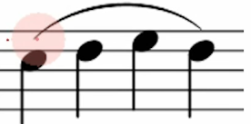
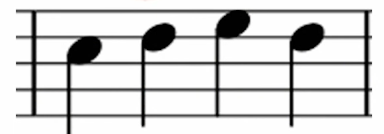

- Phrasing: Slur in group: create a break between the slur to mimic punctuation
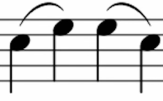

- Staccato: lift finger quickly: finger on fire: opposite of slur

- Staccatissimo: exaggerated staccato; choppy, make the note distinct (old fashion) -> use staccato

- Portato: half-slur, half-staccato, smooth + defined: more separated than a slur
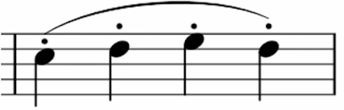
- Accent = Sforzando: Louder
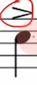
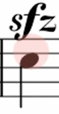
- Marcato: staccato had a baby: loud + choppy
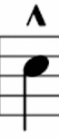
- Tenuto: Long + Strong: hold the note as long as it can be: oposite of staccato
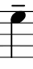
- Tenuto vari: little detached: deliverate and emphatic: pretty much the same as tenuto
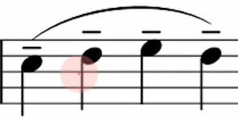
- Fortepiano: Loud on the first, piano for the subsequent: loud then piano
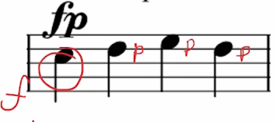

---

# Flute
- flute sound
- slow sustend music
- air and tongue sound
- no sound (percussion)
- Include the inhale and exhale in the piece

## Main techniques
###  1. Key clicks
- percussive technique
- only available when solo (due to volume)
- **Downward clicks are effective**: A-G-F-E-D, ascending requires extra key button.
- can be produced with or wthout sound
- In fast tempo, they will bounce back up (and catch two sound)
- Notated as:
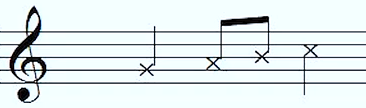
* Don't use too much as they can damage the flute

### 2. Tongue Ram
- percussion technique
- loud
- exhausting -> need time to recover
- Sound like Tongue pizziato, but with air going into flute
- sounds a majot 7th lower than the fingered note
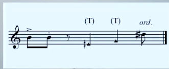

### 3. Flute/flutter Tongue
Flute sound
- sound of a chuchu train(middle - high)/thunderstorms wind (low)
- tonguing sound
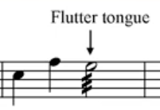

### 4. Aeolian sound
- air sound
- flute sound coming out, but not quite
- low B to mid E/F
- very quiet

### 5. Jet Whistle 
- loud
- exhausting -> need time to recover
- as the title said, Jet Whistle by the flute
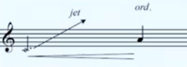
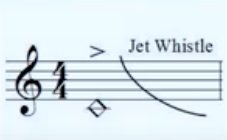

### 6. Harmonic trills or Bisbigliando
- use a perfect fouth below the note
- think about violin harmonic
- Based on the harmonic series
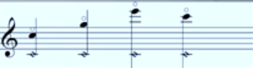

## Other techniques

### Tongue pizziato and Beatbox
- only available when solo (due to volume)
- have speed restriction
- better in ascending scale

### White Noise
- simply blowing air into flute
- air goes out very fast, does not last very long

### Glissando (lip & finger)
Work best in slow tempo
lip
- lip do the inward and outward motion
- possible in all registers
finger
- not convinient in high registers
- easier in middle and low registers
- Convinient finger glissando: B-A-G-#F-F-E-D 

### Multiphonics
- Easiest in low register
- very challenge for fluist when fast tempo
- play loud and quikcly 
- let player find the note
- Need to find the right ones, that can transit smoothly and good response on flute
- certain notes has to be played loud and some needs to be played soft

### Singing while playing
- as described
- multiphonic

### Trimolo
- Always ask the fluest
- doable trimolo: A-E#

### Whistle tones
whistle playing on flute