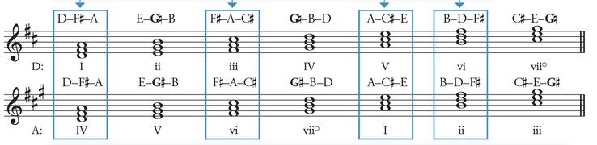
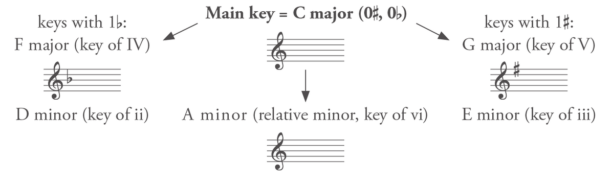
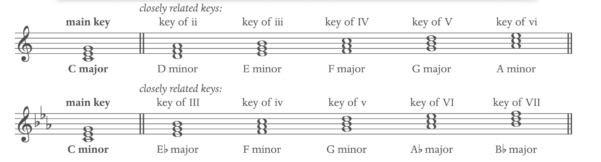
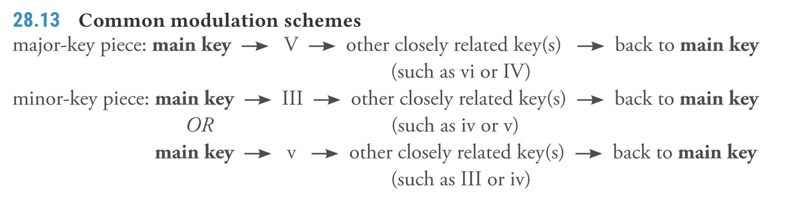

# Modulation

**Modulation**: tends to be a **key change that is long and substantial**, involves a **pivot chord** and is **confirmed with cadence**. The harmonies and scales degrees are labelled in the new key.

## Types of Modulation
- **Pivot modulation**: **shared chord** as a transition
- **Direct modulation**: goes directly into the new key with **no overlap**
- **Common-tone modulation**: Uses **single note** as pivot point
- **Chromatic modulation**: **modulate with chromatic chords**
- **Enharmonic modulation**: **Shared chord** as a transition, but the 
- **pivot chord is enharmonically re-spelled** in the new key.

**Closely-related keys**: keys that differs by no more than one sharp or flat from the home key.

Major
IV - I - V
ii - vi - iii
 
Minor
VI - III - VII
iv - i - v

### Finding modulation
- Looking for the accidental that comes back - change of accidental and change of emphasis.
- Check the tonic of the first chord
- I and V are the most occuring pivit chord

### Pivot Chords
The **first chord in the new key** is also in the main key. The **shared harmony between two key** is also known as a pivot chord. The pivot chord must be **diatonic in both keys**. (No accidental in either key), The **note name must be the same**. Look for the leading tone (the 7 that often with accidental), last chord that can no longer analyze in the old key.

It is best to have **subdominant as a pivot chord**.

**When modulating involves a minor key**, **any chords within scales can be pivot chords** as long as the notes are the same. even the uncommon key. e.g. IV in a minor == V of G

# Modulation to the key of V

| Key of I  | Memo: 1451 & 3662 | Key of V |
| :-: | :-: | :-: |
| I | Becomes | IV |
| iii | Becomes | vi |
| V | Becomes | I |
| vi | Becomes | ii |

**Harmonizing Melodies**: Look for **accidental shortly before the end of a phrase** to identify melody key modulation OR **succession of scale degrees compatible with a progression in a new key** (e.g. B-A melody in C key, modulation to G would be more natural).

**Reinterpreted half cadence**: See cadence section

The V and vii chord usually needs accidental after modulation

**vi^6^ may substitute I when used as pivot chord**

# Modulation to the relative key

**Closely Related Keys**: Modulation can **lead to any keys** (not just V), The most common modulation is to those to the lonely related keys.

**Modulation is labelled relative to its original main key**; The scale includes all the closely related keys in a scale (except diminished):

Modulations in **major-key pieces**: Use the **same rule as V modulation**.

Modulation to **minor key**: it has a special exception for leading note. Remember to **raise the leading note in the minor scale**, even in the new key.

## Extended Tonicizations

Key changes that do not lead to a cadence are considered tonicizations. A single passage can involve multiple short passages with “key modulation”. They can involve a series of harmony before reaching the goal chords.

## Modulation Schemes

