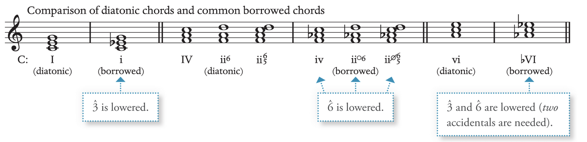

# Modal Mixture

Modal mixture arises when **notes, chords, or passages from the parallel minor are used within a major key**, **or vice versa**: e.g. Passage of A minor appears in A major. A remains the tonic. Hence no modulation occurs

## Parallel Minor in a Major key

**Borrowed chords** (change of quality from the equal parallel key): may involve one to a few harmonies to entire section from the parallel minor. The function of the borrowed chord is similar to the diatonic version of the harmony. E.g. iv == IV and ii○6 == ii6. 

**Lower the 3̂ and 6̂ when Major to minor
Raise by half when minor to major.**

**Minor 6̂** goes down by step when using it in major key: no A2 allowed between intervals.

If the **7̂ appears as borrow tone** (which are relatively rare), they often function as **passing chord**.

### Common borrowed chords: 
- **3̂** e.g. i triad
- **6̂** e.g. ii^○6^ or ii^○7^
- **3̂ and 6̂** e.g. ♭VI

**Embellishing tone with vii^○7^**: the **6̂ may serve as a neighbour tone** within major key

## Parallel Major in a Minor key

**6̂**: Rarely uses borrowed chords with isolation. **Borrowed chords are rare** as the minor key often raises 6̂ and 7̂ as is minor melodic scale: IV and V are not considered as borrowed chords

**3̂**: usually **forms part of applied chord V6/iv** rather than borrowed chord. **The only common instance** of the borrowed chord in a minor key is **at the end of the phrase** where i -> I: known as **Picardy third**.

