# Dissonance

# Voice leading of 7th chord- prep and resolve
**Be Prepare**: approach by common tone > down by step (if not possible) > up by step
**Resolved By**: down a step > common-tone (if not possible) > up a step
- remain its haronic function
**7th chord with era**
Figure labeling, just add the dissonant note beside the figure in the short form: V9
- Classical period: common with **V7, viio7, ii7, ii^o^7** - what we're using in this class
- romantic era: most 7th except I
- Modern music: all chord can take 7th

# Added dissonant chord 
9th, 11th, 13th cho b rd tone
- Only on  V7, viio7, ii7, ii^o^7
- Treat them as **tendency tone**: chodal 7th - going down
- Always include the **root**, **third** and **seventh** (convention during the classic period).
- Chord needs to be in **root position**
- **Omit the fifth**
- Always in the soprano line
- Do **not double** any notes
## How to differentciate dissonance and non-chord tone
how to differenciate non-chord tone and dissonant chord (if a dissonant chord last longer, then there is a obvious synbol of dissonant chord). however it will ultimately decided by how it is interpretated

# Mode Mixture
- Chord from parallel key is used in the piece. C+ key chord used in c- key 
Major - > Minor: lower 3, 6, 7
Minor -> Major: raise 3, 6, 7
- Ending with modal mixture at the end V-I in minor is called "Tierce de Picardie"
- Romain numeral: if roman numeral start with a semitone higher, then put #(sharp), if semitone below then but b (flat) and count the quality chord from there.
- Too much using of mode Mixture can easily turn a piece into modulation
- For the key that doesn't have parallel key: The key are not important, just make sure the 3, 6, and 7 are changed accordingly

# Key Changes
- Differ from modulation, tonicization, mode mixture
### Modulation
- Look how long is the duration of modulation it is.
- Expect a cadence in the modulated key.
### Tonicization
- Should be 1-2 barlong
- can be series of V tonicization
### Mode Mixture
- look for the accidental in 3,6 and 7

# Harmonic Prolongation
- Same chord prolongation
- The sandwitch prolongation
- Mini-TDST
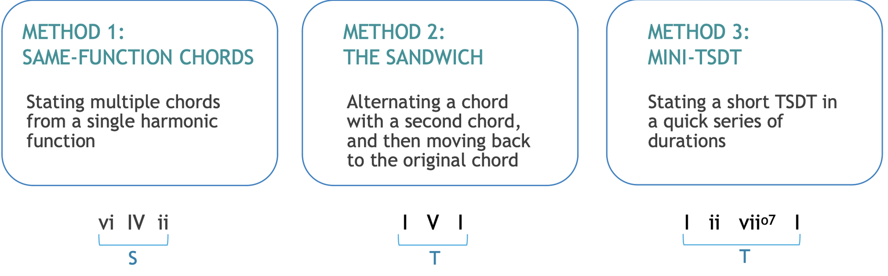

# Jazz Notation
## Lead Sheets

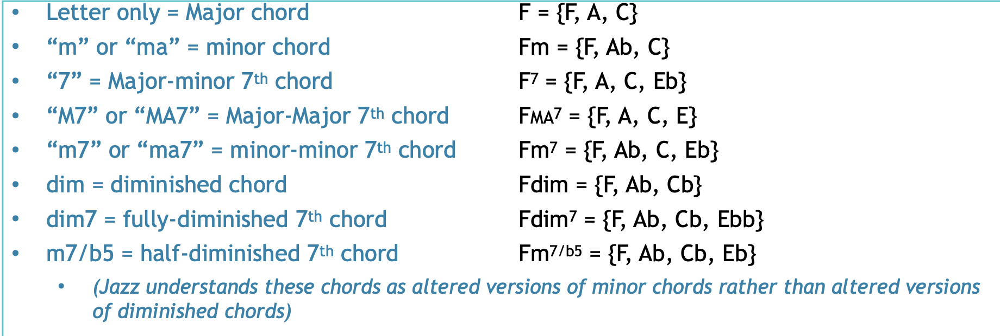

## Slash indicates an inversion

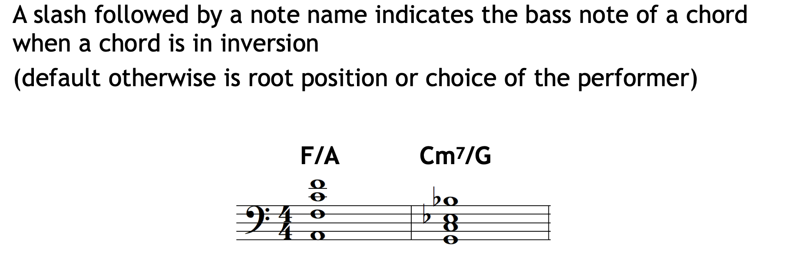

# Jazz Form
## Pop Music Composition
### Basic Form elements
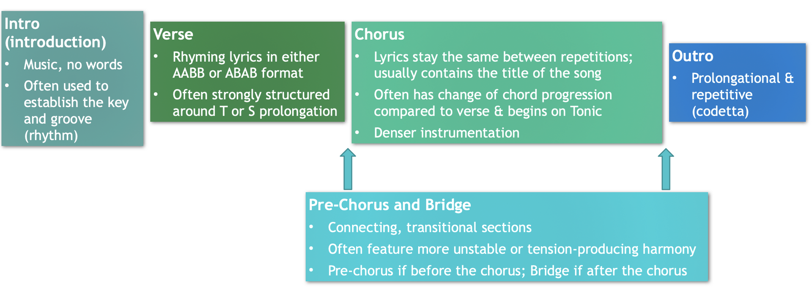

refarin: shorter melody that keeps coming back, there are no other chorus characteristic

Label the part based on their characteristics.

### Elements which delineate form
Text (Lyrics)
Instrument (what instrument are there)/ Orchestration (how to write for those instance)
Rhythm (Tempo)
Harmony (Melody)

# Pop forms
- **Bar Form** (AAB; variation of Binary form)
- **Verse/Chorus Form** (AB repeats several times = modification of
Binary/Rounded Binary or Rondo)
- **12-Bar Blues** (each section contains the same 12-bar chord
progression: I - - - IV - I - V IV I - )
- **32-Bar Form** (listed as AABA in sources, but equivalent to Rounded
Binary, as we’ll discuss in the 2nd half of this term) AABA...
- **Strophic Form** (AAA etc; related to Classical music’s “Theme and
Variation” form. Repeats the music but changes the lyrics.)
- **Binary and Ternary Forms** (same as Classical music)

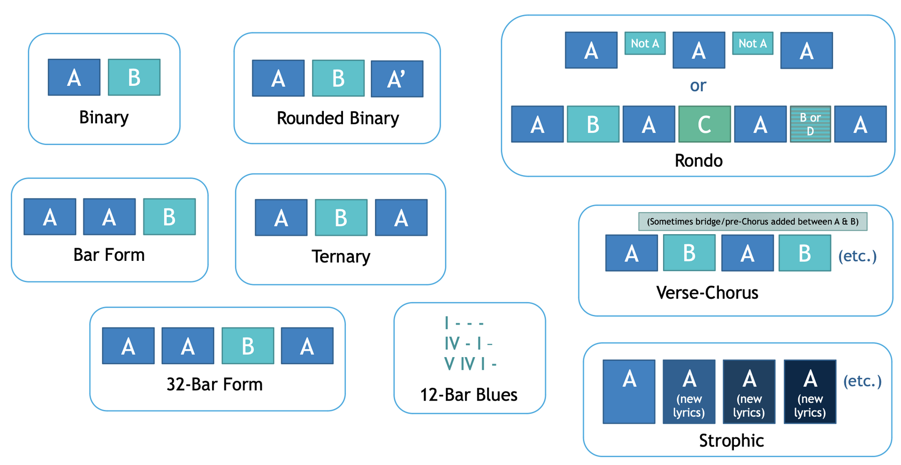

## Pop Style: Harmony
- less Dominant, so no T-S-D-T, Emphasis is put into Tonic and Subdominant
- Root position more common
- Modes also very common - Dorian/Aeolian/Mixolydian
### All the common pop style harmonic progression
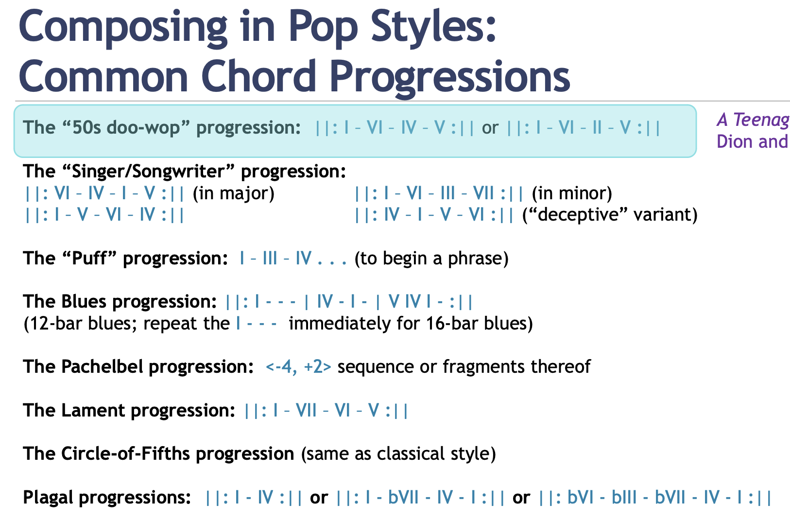
Every Harmony can be both used as Major/Minor

1. A Teenager in Love by Dion and the Belmonts (1959)
2. Love Story by Taylor Swift (2008), intro and chorus sections (left major form) /Behind these Hazel Eyes by Kelly Clarkson (2010), intro section (right minor form)
3. Puff the Magic Dragon by Peter, Paul, and Mary (1963)
4. Mississippi Delta Blues by Muddy Waters (date unknown) (former)/Johnny B Goode by Chuck Berry (1959) (latter)
5. Memories by Maroon 5 (2019)
6. Hit the Road, Jack by Ray Charles & the Raelettes (1961)
7. I Will Survive by Gloria Gaynor (1978) (minor key!) (circle of fifth)
8. Hey Joe by Jimi Hendrix (1966) (cicle of fourth progression)

## Pop Style: Rhythm
- Offset harmonic rhythm and melodic arrivals
- Beat Level Syncopation
- 3+3+2 "Fake triplet"
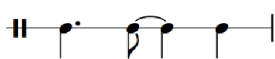
- Bass instrument maintains the same main harmony on the beat

- # Tritone substitution

## Must know of drum
https://drumbeatsonline.com/notation-20-must-know-drum-beats
https://www.onlinedrummer.com/pages/drum-key

# Meter and Accent

differencial the 6/4 or 3/2 is the "accent" grouping, where is two dotting in the measure, hardly to get the emphasis 

pulse : beat
meter: secondary pulse

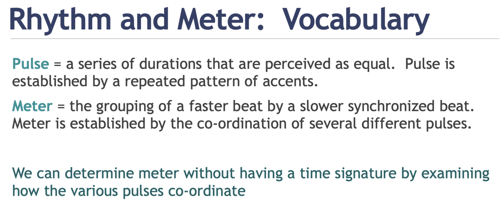

## Type of accent
- Duratioal: anytime, long note after short note, D often line up with short beat
- Registral: highest and lowest note of passage
- Leap: the larger, the stronger the. accent (3rd is the smallest leap)
- Beginning: note after a substantial silence
- Repetition: duplicate previous content (mostly rhythm or pitch)
- Dynamic: Dynamic level change signifcantly
- Articulation: Change in articulation

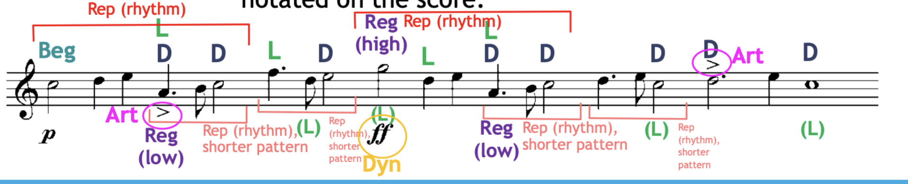

## To distinguish bar
- Area with multiple acctent often represent strong beat
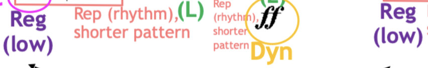

## Segmentation

### Beginning
- Any change from the previous material: i.e. register, instrument, etc.
- preceded by a rest
- distinct ending such as cadence
- repeated pattern

## Phrase Model
- Sentense:
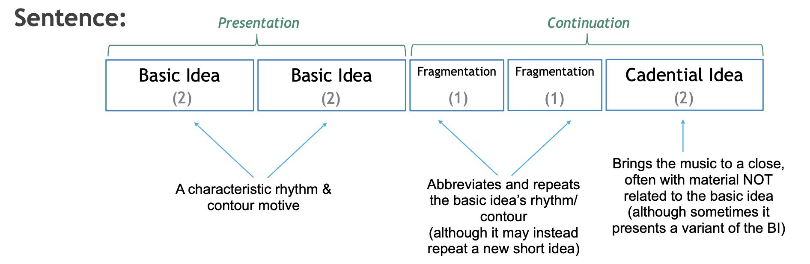
BI, BI, Fragx2, CadI
- Period: 
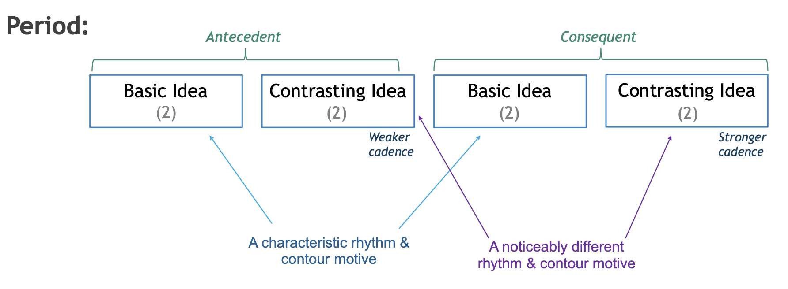
BI, ContI, BI, ContI
- Hybrid: half of each:
	- i.e. BI, ContI, Fragx2, CadI
	- i.e. BI, ContI, BI, ContI
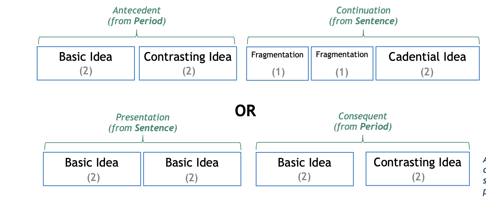
* Contrasting Idea does not have to be the same. 
* Contrasting Idea is everything contrast to the basic idea. (by factors)
* Phrases ae determined by the melodic voice
The most common ratio for sentenses are "power of 2"4, 8, 16, 32. Any difference will be **phrase deviations**.

## Cadence strength
- HC - Weakest
- IAC - Medium
- PAC - Strong
- Many factor can impact cadence strength, such as inversion, tonicization, rhythm, cadential 6/4

# Deviation
Four type of deviation:
## Extra-content:
1. **Extension**: added content (can be deleted)
- **Pre-cadential** Extension (extra repetition) : stuff before a PAC 
- **Mid-cadential** Extension (evaded cadence): sfuff between the cadence(weak cadence) and extra cadence (PAC ) 
	- Quality: Deceptive progression, Weakened Harmonic Progression, Melodic continuation
	* Use Harmony to figure what's happening next
- **Post-cadential** Extension (Harmonic Prolongation): keep going after a PAC
1. **Expansion**: phrase that stretch: 3 bar BI instead of 2 bars
## MIssing-content:
3. **Compression**: deleded content: 1 bar BI instead of 2 bars
4. **Contraction**: phrase that shrink: missing a segment

* Link: the join section between two phrase they often appear to be extra.

# Forms
The following quality are descriptor to describe the forms

## Binary, AB form

### A section
- Theme: Distinct theme
- Modulation: Modulation partway through to the dominant/relative Major
- Different Ending: Ends with some chord other than the tonic of the home key
- Traditional Phrase convention: Conventional phrase organization (slight deviation is okay)

###  B section
- Developmental: Longer and more developmental than A
- Some other home key than A section: Re-establishes the home key
- More phrase deviation: Looser-structured phrase groups
- Sequence: Often incorporates sequences
- Variation with A theme: Commonly incorporates motivic material of A with variation

## Rounded Binary, ABA'
BA' usually a same unit (together within repeat sign)

### A section
- Same as Binary A sectin

###  B section
- Shorter than the A
- contrast compared to A
- prolongs V or arrives at the V key
- Ends with HC and move back to the home key for section A

### A' section
- reiteration of A theme
- not identical to the A, may have different length or harmony
- provide a suitable cadence in the home key

## Ternary ABA

### A section
- Ends in authentic home key
- Starts and end on the same tonic key
- Expository
- Tight-knit phrase and structure

### B section
- expository, often has its own theme
- different key than A
- tight-knit phrase and structure

### A section
- Often has the same repeat as A, Da Capo
- If not identical
	- Length and harmony are the same
	- May feature melodic elaboration

## Composite form
- Form nested within a form
- Very common in Minuet and Trio movements

# Jazz Harmony
Bmaj7 =  with root B Major-Major 7
B7 = with root B Major-Minor 7
Bmin7 = with root B Minor-Minor 7
