# More Forms

# TSPDT
- TSDT -> TSPDT, P stands for Chromatic Pre-Dominant
- Chromatic Pre-Dominant = Accidental (chromatic) + comes before V chords (Pre-Dominant)
- This also includes Tonicization (V/V and vii/V)
- Prolongation can also be appled on P chord

# Neapolitan Chord
## Description
- P chord category: Chromatic Pre-Dominant
- Servces to prepare and lead to the dominant chord (goes before applied chord)
- root note is lowered
- first inversion
- major chord
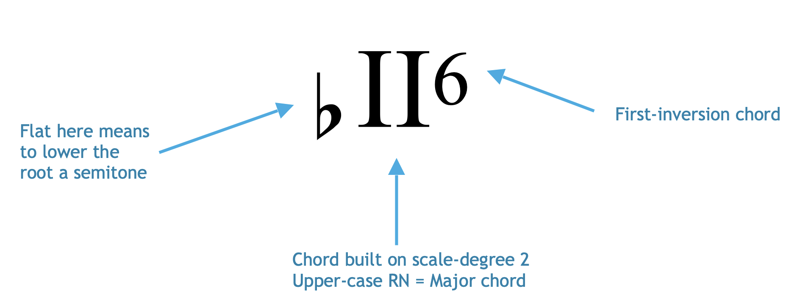{width=75%}
## Carefull that...
- To find a Neapolitans: look for flat ^2
- Very easy to create parallel
- Subdominant can be missing (S replaced by P)

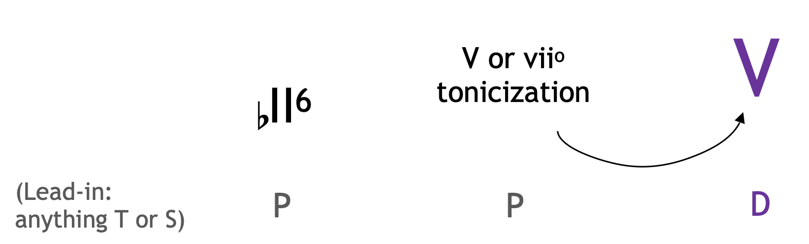{width=50%}

## Our Rules for the voice leading
- Must in first inversion (tho the analysis might appear in root position)
- ^2 resolve down to ^7
- Double the 3rd of the chord

# Augmented 6th chord
- P-function chord
- chromatic voices to ^5 in two voices
	- these two notes are augmented 6th apart
- they are voice leading, **defined by their relation to V**
- The A6 resolution expands outward. (^b6 to ^5 and ^#4 to ^5)
- Three type of augmented 6th chord
	- Italian 6th
	- French 6th
	- German 6th
- Labelling: no inversion or Romain numeral 
## Build a augmented 6th chord

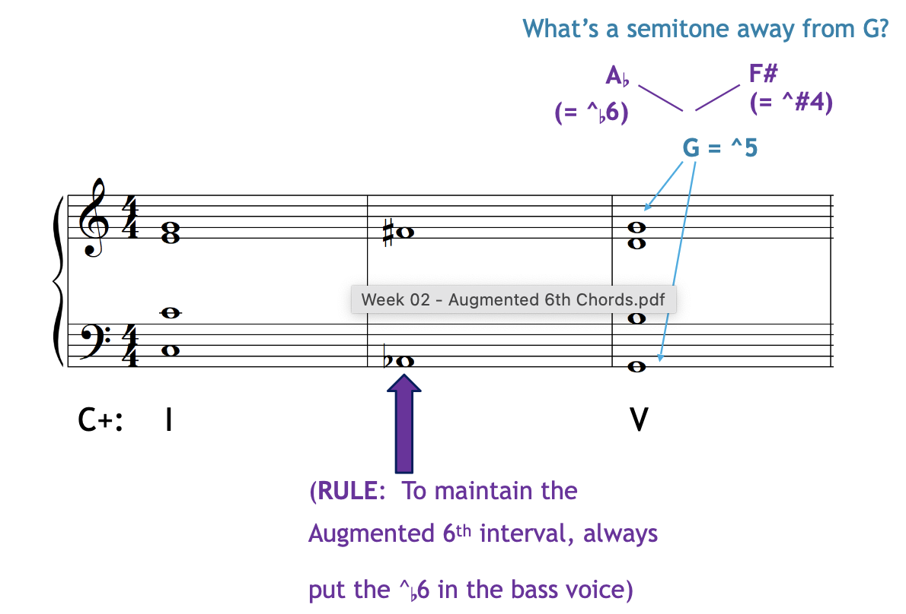{width=75%}

- finding two scale degree 5 (root note of V) with chromatic note away
	- Note that the chromatic that goes down must be in the bass
	- The lead is in a < shape
- add ^1 for stability
- add the appropriate extra note (Think about the geographic notation where Italian 1 on the bottom, France 2 in the middle and German 3 on top ) (as long as it is semi-tone away, it is good):
	- ^1 for **Italian** (another tonic)
	- ^2 for **french** (major second)
	- ^b3 for **German** (minor third)
		- Note that this will create parallel 5th, so use cadential 64 to avoid parallel.

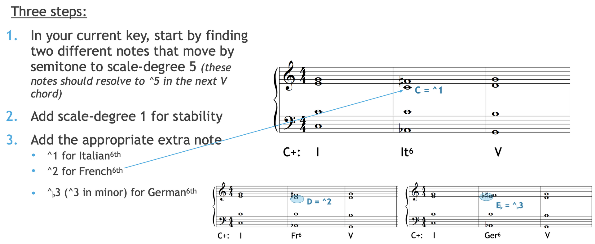{width=75%}

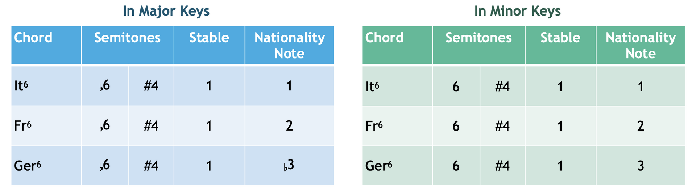{width=75%}

# Other non P-chord type chromatic chord
- Other type of chord that include chromatic tone that is not a P type of chord
- Their harmony function stays the same as the non-chromatic version of their counterpart.
- non-P chromatic chord type during the Romantic-era music:
	- Altered Dominants
	- Secondary Mixture

## Altered Dominants
- Can be used in anywhere the V would go
- **Variant of V chord which the 5th of the chord (chordal fifth) is either raised or lowered by semi-tone**
- Same rule apply to the minot version

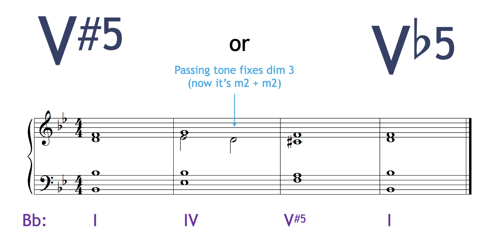{width=75%}

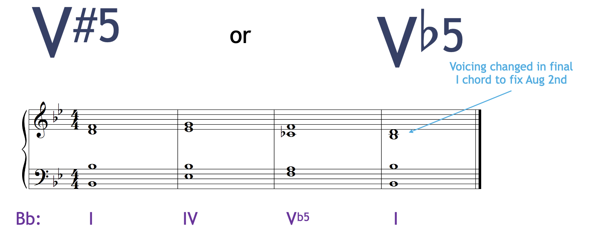{width=75%}

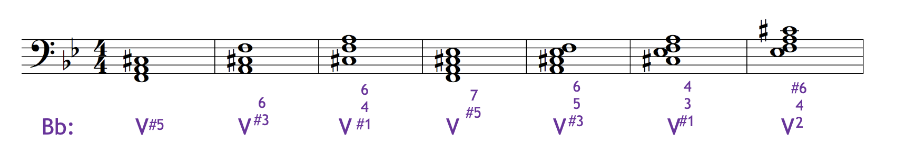

## Secondary Mixture
- When the **quality is changed** but the **root of the chord remains the same** 
- This is different from Mode mixture where Mode mixture borrows chords from their neighbor keys. 
	- Mode Mixture: change the chord by borrowing accidentals from the parallel key. Usually involve raising or lowering the ^3, ^6, ^7 tone 
	- Change of the quality based on the root of the chord

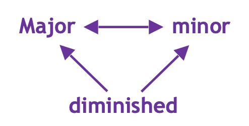{width=50%}

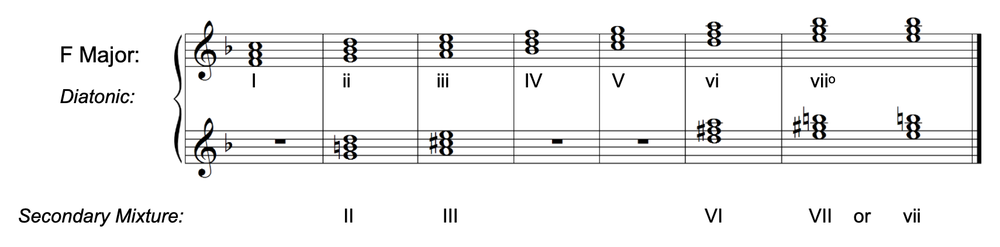

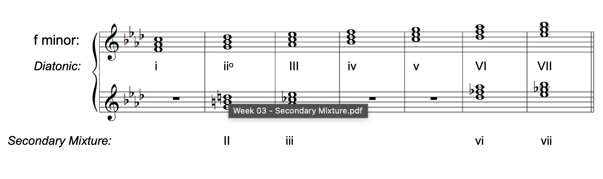

### Build a secondary chord mixture
1. Choose a chord from the original diatonic scale
2. Keep the root the same
3. Depending on the original chord quality:
	- If Minor: raise the 3rd by semitone -> Major chord
	- If Major: lower the 3rd by semitone -> Minor chord
	- If Diminished: Do one of the Minor/Major Step above + raising the ^5

### Exrta notes on Secondary Mixture
 Note that secondary mixture doesn't always work, a simple way is just to treat them like non-chord tone (contrapuntal chords)
- watch out for awkard melodic intervals (dim3/aug2) to add fixes
- **If the secondary mixture duplicates the pre-existing chord type, then they aren't secondary mixture**
- **I, IV, V in Major and i, iv, v in minor** will produce the same result as Mode mixture chords.
- A newly-introduced Major chord whose root moves by P5th down (or P4th up) to the next chord will be a tonicization and therefore cannot be a SM chord 
	- e.g. watch out of I ii V, secondary Mixture on ii become II
	- Things become I II V, but II is actually the tonicization of the V, this is understood as a tonicization rather than secondary mixture
*exception if the chord that follows them is diminished
• It’s extremely rare for tonicizations to be SM since this eliminates the raised ^7 in the temporary key, which is the note that makes us actually hear it as a tonicization (Secondary Mixture can rarely be tonicized)
- **The precedence of secondary mixture come last.**

# Enharmony Mudulation
- Modulation through respelling the chord enharmonically
- Enharmony equivalent: sounds identical but is spelled differently
- Exploit the structure of viio7: The interval between each notes are equal, hence makes it a good canditate for enharmonic modulation
- Exploit aural similarity between Ger^6^ and V^7^
- Creates modulation between distantly-related keys
- Common enhamony mudulation will be using chord of:
	- vii^o7^
	- Ger^6th^
	- V^7^
*Note that the voice leading follows on the newly spelled chord

## vii^o7^ to any Modulated vii^o7^ inversion
- Symmetric structure: same interval in between chords
- The new key can either in major or minor
*Note that vii^o7^ has ^7 natural
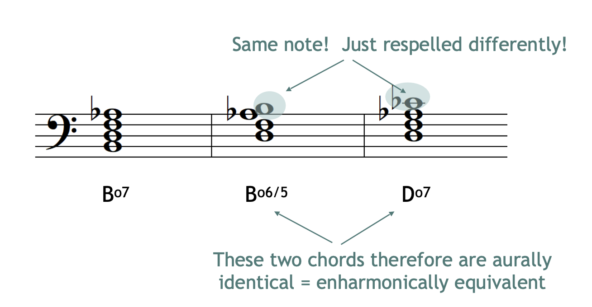
- Any Note within vii^o7^ can be choosen as the new root of vii^o7^
	- The new vii^o7^ will be respelled based on the choosen root
	- If the new root is the chordal 7th, this ^4 note need to be repelled to its relative notes (Ab -> G#)
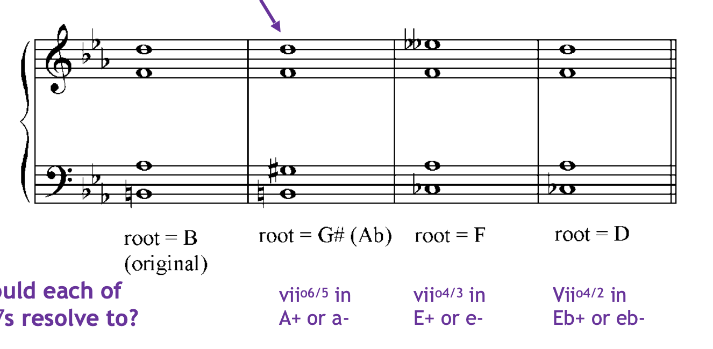
Choose any of enhamonic equivalent chord (2-4 measure) to modulate
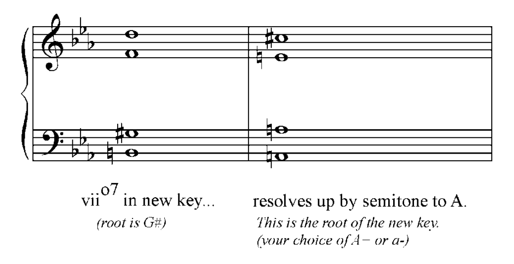
- The new vii^o7^ can resolve up by minor second to its new key.

## Enharmonic between V^7^ and Ger^6th^
- The root of the Ger^6th^ (usually ^b6) is the root of V in new key 
	- aka The root of the V is the ^b6 in Ger^6th^
- Count the new key from this new V (down by 5)
- The new key can either in major or minor
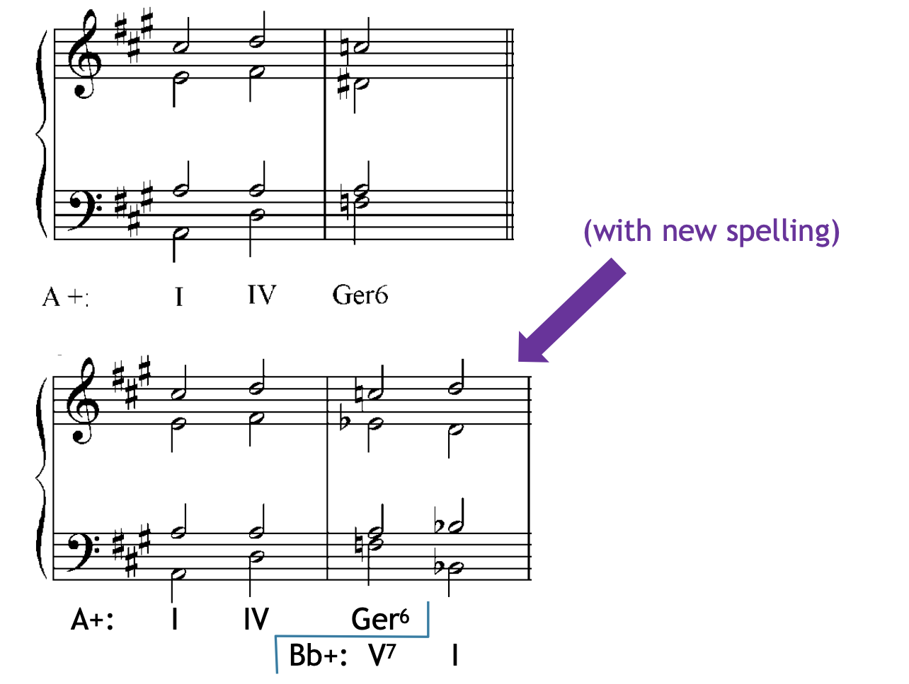

## Common Tone Relationships
- Mostly seens in prolongations
- Contrapuntal/elaborating chord winthin larger prolongation
- Inversion does not matter
- The CT chord can comes from the chord before the chord after
- No traditional Roman numeral
- There are three different type of common-tone:
	- CT fully/half Diminished 7^th^ 
		- Fully: all m3^rd^
		- Half: m3, m3, M3 from root
	- CT Mm7^th^ (dominant 7th)
	- CT Aug7^th^
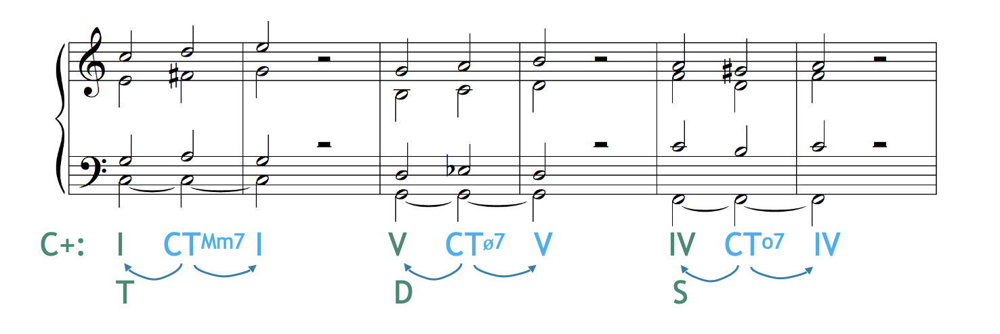

- Steps to construct a ommon tone
	1. Keep the root of GC as common tone (This is the 7th of the common-tone chord)
	2. Stack thirds below the common tone and add the accidental to form the  quality (dim/Mm/Aug) of the chord. Do not modify the CT 7^th^
	3. Rearrange the chord to create smooth motion in each voice (max the leap of third)

- Note that:
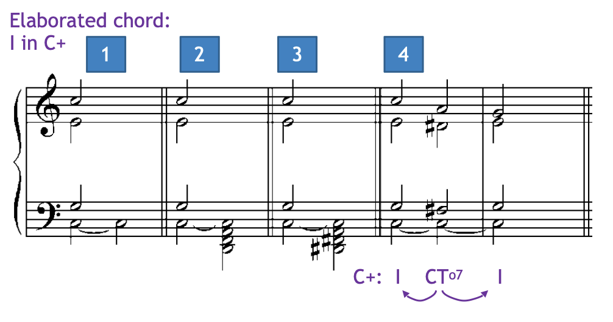

- The CT does not have to be in the bass
- CT 7th does not need to resolve down by step (because its contrapuntal chord)
- CT note can be repeated without a tie
- The root of the goal chord will always stays the same (no matter where this chord is located)
- Some CT note can form an already existing chord

# Jazz Harmony

### Terms
- Extensions: Added dissonance chords 9th , 11th , 13th 
- two-five-one: tonicization, mostly refer to ii-V-I
	- m7 followed by Mm7 (Dom7), the ii^7^ - V^7^ combination
	- m7b5 (= Ø7) followed by Mm7 (Dom7), the ii^Ø7^ to V^7^ combination
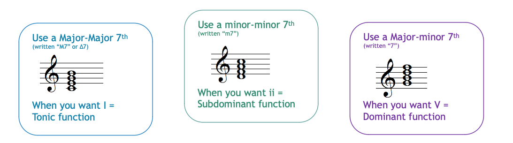
- Very common to vary the Jazz chord given on the lead sheet
	- "Extensions"
	- chord with 6/7th, SUS chord
	- Altered dominant

## Tritone substitution
- This can replace the original fifth
- Tritone substitution is to count the Mm chord that is tritone away
- Usually uses the tritone that can go down by 5th to the tonic

| V | I |
|:-:|:-:|
| G7 | CMaj7 |
| Tritone: Db7 (Db7 is common because 5th down) | CMaj7 |
| Tritone: C#7 | CMaj7 |

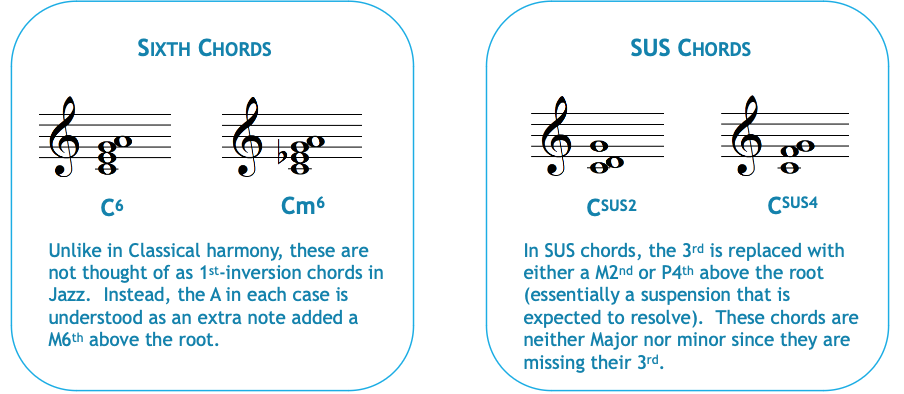

# Sonata Form Expositions
- In short
	- Two Keys
	- Two Things
- Subordinate key:
	- in Major = key of V
	• in minor = relative major key

### Overview
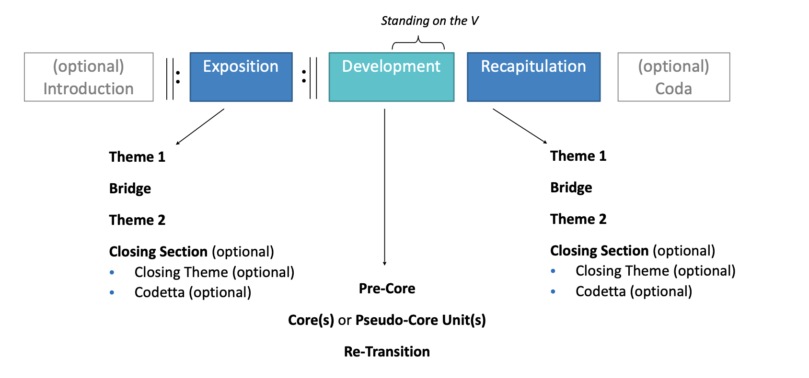

## Exposition
- **Theme1**:
	- occurs fully in **home key**
	- distinct **melody**
	- tight-knit -> **standard phrase model**
	- Moderate or **fast tempo**
	- Could have more than one phrases
- **Bridge** (modulating transition)
	- **Destabilize the home key** and modulate to the subordinate key
	- thematic continuation
	- **end in HC in new key**
- **Theme2**
	- contrast with theme 1
	- **Slower**, more lyrical than theme 1
	- In **subordinate key**
	- **End with PAC**
- **Closing Section**
	- Optional section
	- new material after theme 2
	- Two possible theme:
		- **Closing Theme**
			- Final thematic material before exposition
			- appear to be new thematic (fragmentation)
			- contain full phrase, TSDTs and cadence
		- **Codetta**
			- Only fragmentation/ or repetitive of motives
			- Consist of harmony prolongation (Post-CE)
			- not a standalone phrase and does not have a cadence

## Recapitulation (Similar to Exposition)
Bring back the exposition theme material | Similar to exposition | remain in the home key | may eliminate portion of the exposition and replace with new material | Does not transition into new material - retain closing theme or into codetta
- **Theme 1**
	- Resolve the series of V brought by development section
	- **Often Undergo Structural changes**
		- **deletion of theme restatements**
		- added **model+sequence** pattern
		- **no home-key cadence**
- **Bridge**
	- Does **not modulate**
	- tonality unstable via **chromatic chord**
	- often include **tonicization of IV** (give a sence of TSD)
	- **End in V** and into the theme2 (with a series of V at the end)
	- **Compress** the original **bridge** material
	- Further **develop motives**
- **Theme2**
	- Occurs in home key
	- loose organization
	- expanded from exposition
	- end with **strong cadence** in the home key
- **Closing Section**
	- Occur independently of a "transition" function
	- May function as a transition to coda
	- Codettas
		- replaced by coda or extended closing section
		- or re-worked to provide more harmony rather than prolongation

## Development
### Technical Details
### Motivic Elements
- **re-uses previous themes**
- Multiple themes may be developed
- Emphasis on **sequences**
	- Sequence = repetition with transposition
- Loosest formal organization of movement
	- **No standard phrase**
### Harmonic Structure
- **Avoids authentic cadences** in the home key
- Has a **series of modulations**, often to “remote” keys
	- based on modal contrast with 2 nd theme
	- end is usually V of home key
### Techniques
- **Fragmentation** and re-combination
- **Variation**
	- Different things might happen
- **Re-orchestration**
	- Melodies might be moved to other lines
- More rarely, introduction of new motives
	- Might have new materials

### Sections
### Pre-cores
- Begins with **tonic of subordinate key** (from end of exposition)
• Introduction-like character; **more relaxed “feel”** than core; features softer dynamics, less rhythmic activity, transitional function
• Motivically, often derived from theme 1 or closing theme of EXP
• Commonly **loose-knit** (structured around loose versions of standard phrase
models)
### Core or Pseudo-core
#### Core
- **Core = model + sequence unit (a model + sequence of model)**
	- model is commonly 4-8 measures long (often a full phrase)
	- transpositional pattern may change throughout core
	- features fragmentation
- Possible to have more than one core if motivic material changes
- “**Sturm und Drang**” quality
	- Grove Music Online: “artistic aims: to frighten, to stun, to overcome with emotion
	- Minor key
	• Dynamic extremes & contrast; more use of sfz, crescendo
	• Counterpoint rather than homophony
	• Chromaticism
	• Dramatic contrast
	• Agitato figures (esp. bass 8ves)
- Core units often end on V (=HC) in their key, or another type of unstable
cadence
#### Pseudo-core
- No model + sequence technique
- Still has character of development (eg. Sturm und Drang, etc.)
- May have improvisatory style
- **Common in Haydn’s development sections**, which generally do not use the core/pre-core procedure

### Re-Transition
• **Leads into (and includes) the final standing-on-the-V** of the development
section
• **Leads back to home key**
• Commonly **incorporates motivic material** from theme 1
• **D-prolongation**

# Framing Sections
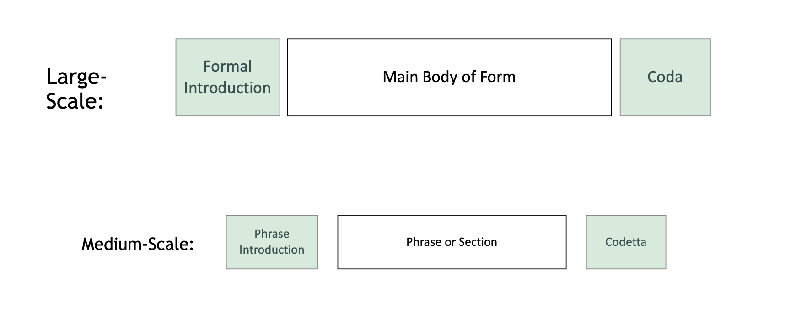
The **Formal Introduction** and **Coda** are **Standalone Sections**
-  The middle part can be **anything large**:
	- Rondo: ABACABA
	- Binary or Ternary: AB, ABA, ABA'
	- Sonata
- Or **anything small**:
	- Phrase
	- Short as a single bar in the phrase introduction
	- etc

### Generally, Intro and Coda
• **Slow** in tempo
• Often has a **different tempo** marking (text or metronome marking)
• “Solemn, **serious tone**”
• **Least predictable** of all large-scale formal units (loose-knit)

## Features
### Formal Introduction
- **Sense of anticipation** created by:
	- melodic, rhythmic, textural, and dynamic discontinuity
	- instability in harmonic progressions
	- minor mode
	- extensive chromaticism
- Has qualities associated with **French overtures**
	- fanfare gestures
	- tutti textures
	- dotted rhythms
	- initial *forte* dynamic
- Usually **contain their own theme**(s)
	- Do not generally modulate, although prominent tonicizations do occur
	- Often end with HC of home key or cadential elision leading into theme 1
- **Distinction**: Very short units are normally phrase introductions or codettas, whereas longer units tend to be formal introduction sections or codas
	- Short units often involve harmonic prolongation, little harmonic profile (i.e. no distinct, memorable melody)
	- Longer units may themselves have shorter ones embedded within
### Codas
- Distinct from other sections such as the recapitulation
- Is present to “express the temporal **quality of “after-the-end”** ”
- **Remains in home key**, although may use tonicizations or chromatic sequences
- In sonatas, begins after the exposition material has all been re-stated (although beginning often obscured). In rondos, begins after the end of the final A section.
- “the composer can **make up for events or procedures that were not fully treated in the main body** of the movement”
	- recall main theme ideas
	- present exposition material omitted from the recap
	- re-state ideas from the development
	- shape the overall dynamic line
	- complete a process (eg. wind down from a climax)
### Codas vs Codettas
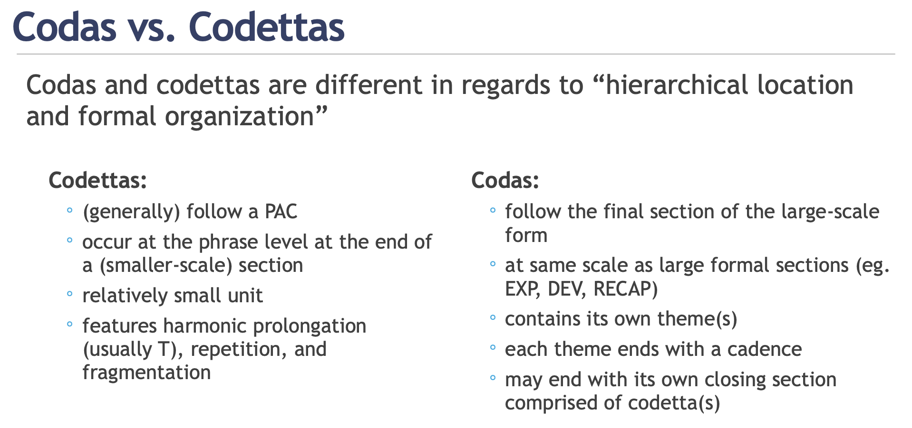
- **Codettas: Short and repeated prolongation**
	- no phrase
	- no cadence
	- no TSDT, or mini TSDT prolongation
- **Codas: Long and contain its own theme, may include codettas**
	- is a phrase
	- has cadence
	- Has full TSDT

# Rondo
- Rondo Form: Features motive A that returns repeatedly throughout the piece
	- 5 parts
		- ABACA, B and C are contrasting material
		- ABA(B/C)A
	- 7 parts
		- ABACA(B/D)A
	- Sonata-Rondo
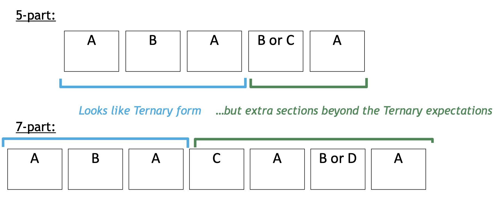

### General Features of Rondo
- **Main thematic idea alternates repeatedly with contrasting idea**
- Similar to **ternary form**; can be thought of as an **expansion** of this form
	- alternation of one expository, returning section with contrasting material
	- often palindromic structure
- **emphasizes contrast**!
- Often used as final movement in symphonies, sonatas, concerti, etc.

### Large-scale Feature
- Can involve composite structure (where the A, B, C section itself may contain Binary or Ternary)
- One section to another via a transition section
- Coda can be added at the end of the sections:
	- ABABA(Coda)
	- ABACADA(Coda)
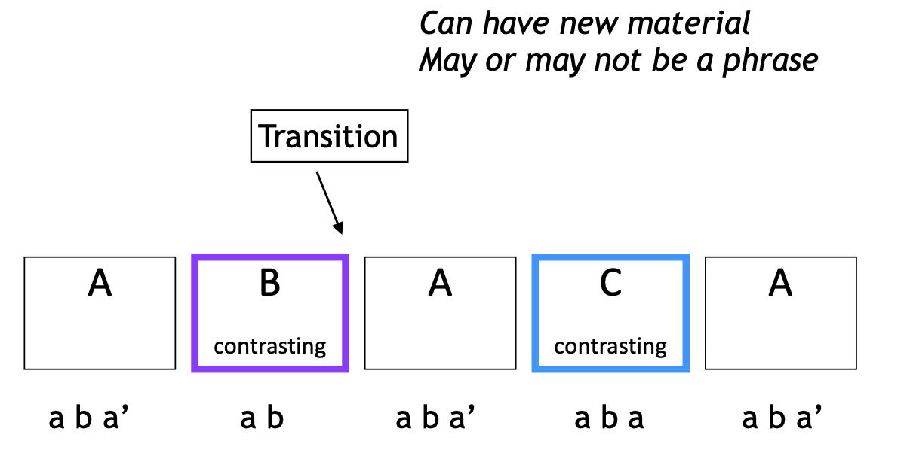{width=75%}
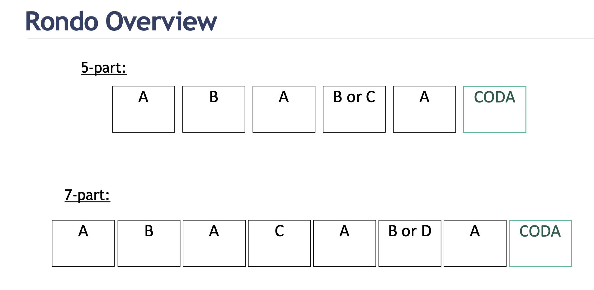{width=75%}

### Sections
#### Section A
- **Tight-knit phrase** forms
- Occurs in the **home key**
- Sometimes embellished or truncated, but usually **no significant modification** to the underlying harmony occurs
#### Section B & C & D
- Feature **significant contrast with A**, which may include...
	- motivic design
	- tonality
	- modality
	- rhythm
	- texture/orchestration
- **Not in the home key**
- Usually begin **immediately in new key** (i.e. uses direct modulation)
- Are also **tight-knit**
- **May end with V of home key** to smoothly lead back to A tonality

# Sonata-Rondo
Sonata-Rondo includes the elements of both Sonata and Rondo
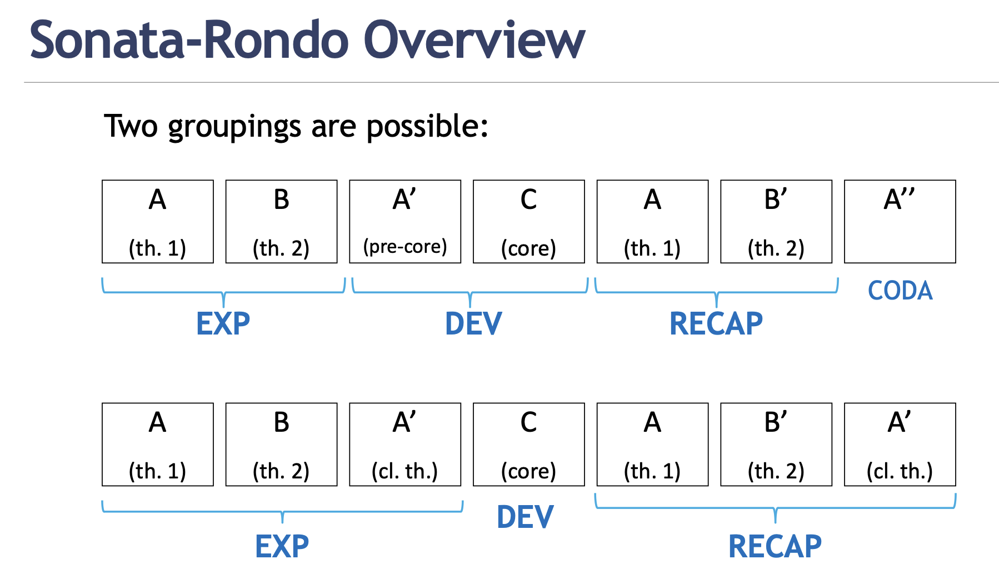

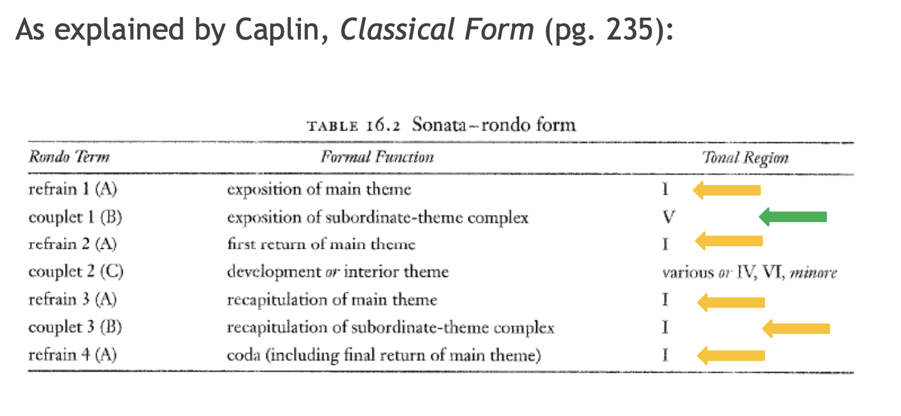

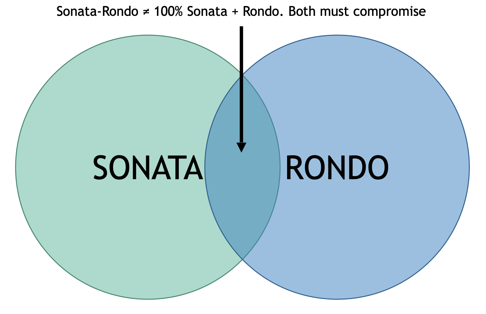

### Comparing Rondo and Sonata-Rondo form
| | Regular Rondo | Sonata-Rondo |
| - | - | - |
| A Sections | A returns exactly or with only minor variation (same criteria as Ternary form) | Repetition of the A section at the end of the exposition is often varied and incorporated into the closing theme material |
| B sections | Repetitions of B are normally in the same key | B can appear in two different keys: in the subordinate key the first time through, and the home key the second time through (same as Sonata) |
| C sections | C is usually (new) contrasting thematic material | Thematic material from A and B return in C (usually fragmented) |

### Sections
#### Section A
- **Return of A** can be **significantly varied** in sonata-rondo (for example, the A’ is commonly an abridged version of A)
- Can use a **variety of phrase forms** (i.e. need not be tight-knit)
#### Section B
- Features the **theme 2** and sometimes a transition
- Occurs in the **subordinate key** (i.e. V in Major, III in minor) the first time, and the home key the second time
- May **lack cadential closure**
#### Section C
- Developmental function, and therefore likely to **recycle themes from A and B** sections
- May **modulate extensively**
- Typically acts like a **developmental “core” section**, with significant fragmentation, sequencing, and modulation