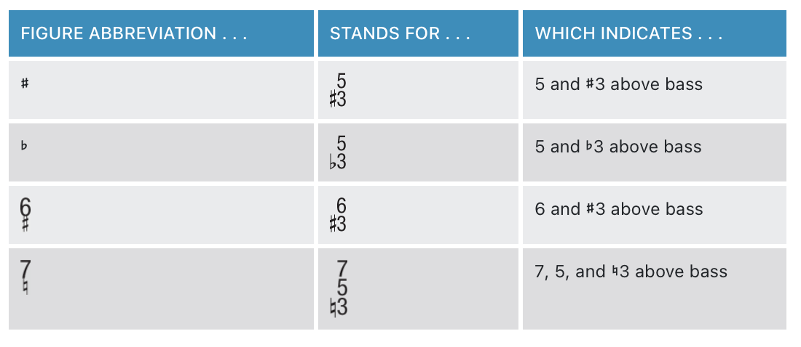
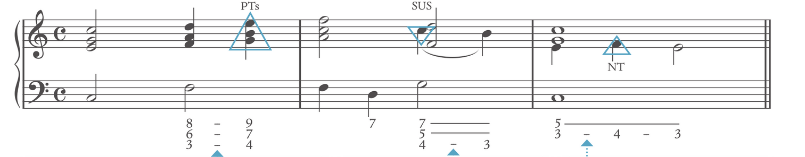
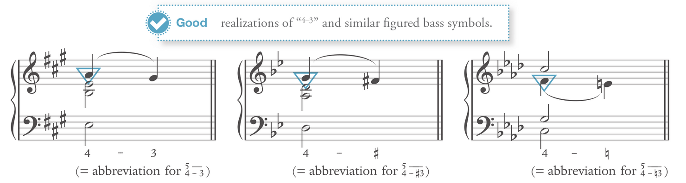
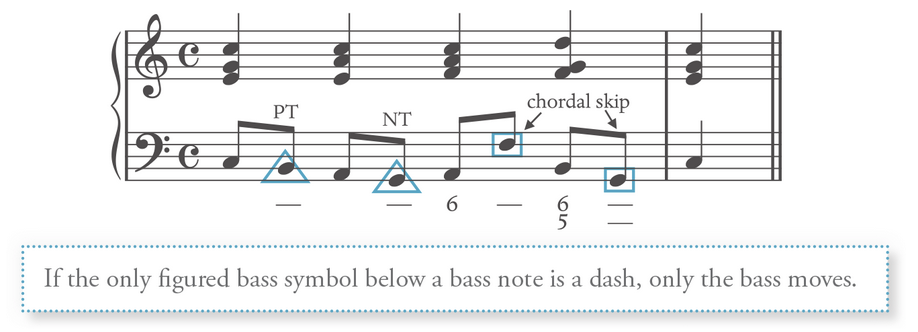
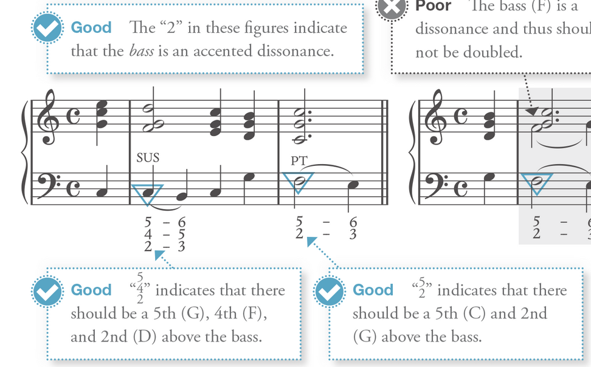
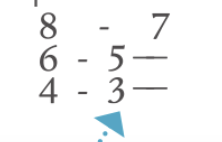
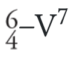
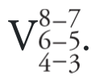
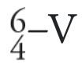
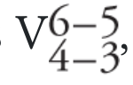

# Notation

## Figure Accidental

**Accidental without number always refers to the 3rd**

# Figure bass notation

## Triad: 
(inversion)
Root: 53 - **N/A**
First: 63 - **6**
Second: 64 - **64**

## Seven chords:
(inversion)
Root: 753 - **7**
First: 653 - **65**
Second: 643 - **43**
Third: 642 - **42** - **2**

Figure **9**: 953 (9 is the embellishing tone for the next chord)
Figure **4-3**: 54 - 53

**Aalways follow the figure to determine the chord and its supposed inversion**: Technically, the notation of the inversion reflect the figure  notation, for the sake of identification, go with figure bass first then identify the chords

# Figure Bass in writing

## Embellishing Figured bass

Only the bass moves in an embellishing tone with a dash below it. The upper voice remains stationary.

Bass should not be doubled when there is a 2 in the figure bass 

## Different way of notating Cadential 64

# Pedal Notation
1̂ Ped -------

1̂