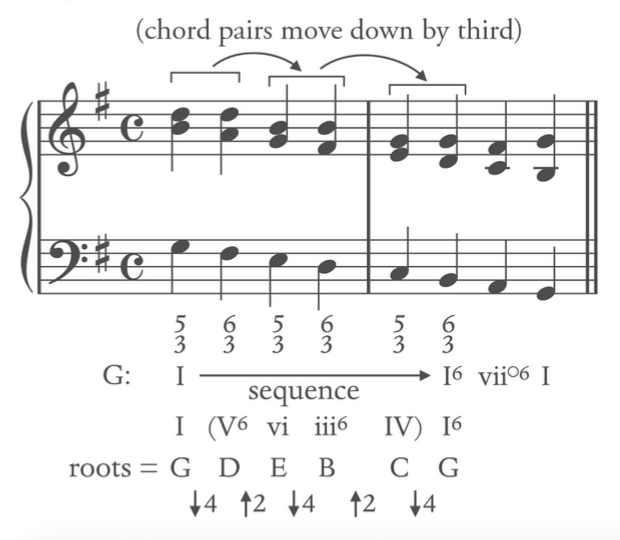
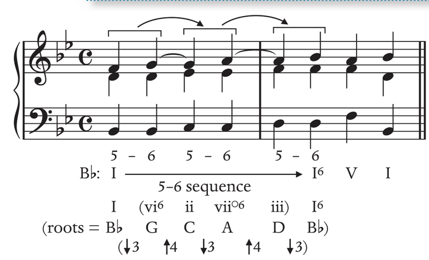

# Sequence
A pattern of harmony that is transposted in a similar pattern.
**Sequences: suspend a harmonic function**, hence sequence is a type of **prolongation**.
In minor, the **leading tone** are **not raised within sequence**.

### Sequence has the three following types: 
- **Melodic Sequence**: The melody is repeated and transposed, but not harmony.
	- Model: Original gets transposed
	- Sequence: transposed of repetition
- **Full Sequence**: both melodic and harmony are transposed
- **Harmony Sequence**: interval between chord roots is repteated  (transposing the progression)

---

# Harmony Sequence

Sequence is a **repeated pattern in a succession**

An inversion (base note) changes does not changed the fact that it is a sequence. The root defines the sequence.

It can be as **short as a single beat** to **long as several measures** (melodic sequence) **to several harmonies** (harmonic sequence)

Often **labeled by the pattern** formed **by their roots**

Features a harmonic sequence **involves a two-chord pattern transposed up/down**; The **logic of chord succession derives the harmonic pattern**, not from the function (Tonic, dominant or subdominant)

# Full Sequence
the following are mostly full sequence because no inversion is incorporated.

# Descending Sequences

## Root alternate up 4, down 5 (Most common)

**Descending fifth sequence** (circle of fifths progression)
Every pair of chords moves down by step, it is possible to replace the root position with seventh chords, inverted chords or both in a pattern

## Root alternate down 4, up 2

Every pair of chords moves down by a third

## Descending parallel 63 chords

Reasong why only parallel 63 is allowed: Parallel 53 results in parallel fifth; Parallel 64  involve dissonances issue (not resolved voice leading)
Often **appear in three-part** than four-part textures
**Often decorated by 7-6 suspensions**

# Ascending Sequences

## Root alternate up 5, down 4

**Ascending fifth sequence**
**All the triads must be either major or minor**
Every pair of chords moves up by step

## Root alternate down 3, up 4

every pair of chords moves up by step

### down 3, up 4 Variation: root+first inversion triad
Ascending 5-6 sequence
**Appears in a three-voice texture**

# Voice Leading

**Parallel and unresolved chordal are not allowed** within the sequential progressions

The **leading tone can be doubled**; the momentum by the sequential pattern repetition overrides the tendency of the leading tone

In the middle of a minor key, **7̂ does not need to be raised**.

