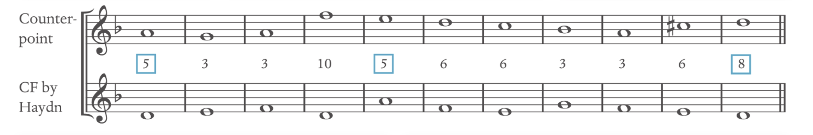
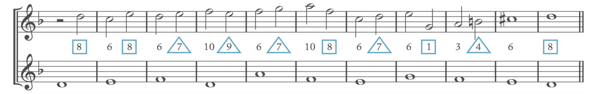

# Species Counterpoint

## First Species

**One-Note Against One-Note: whole note and no dissonance in first species.**

1.  **Only** use **Perfect Consonance** (P5, P8) and **Diatonic Consonances** (major/minor 3rd and major/minor 6th)

- **AVOID all seconds, fourths, sevenths and augmented/diminished** intervals.
- **Be aware of Diminished Fifth (4̂&7̂)**
- **AVOID dissonance**, meaning the interval of tritone, in the scale of C: B&F
- **Perfect unison** is used for the **first and last notes**. (Can include one pair in the middle of a realization)
- Perfect fourth is considered as dissonance when writing in two parts.
- **AVOID Unison**.
- Raise 6̂ in minor if needed to avoid augmented second.

2.  The **two-part** must **NOT be further than 2 octaves** apart.
    
3.  The **FIRST** bar: **lower** voice must have **1̂** (C.F), **top** voice **begins with 5̂ or 8̂**
    
4.  The **LAST** bar: **lower** voice must have **1̂** (C.F), top voice **always end with 8̂** (5̂ rarely)
    
5.  The two-part Cadence in the **last two bars** often **uses scale degrees 2̂ and 7̂ and resolves to perfect consonants**. The leading note **7̂ is raised as needed**. **Chromatic semitone is forbidden**, i.e. Avoid 7̂->7̂#->8̂ cadence.
    
6.  Vary motion by using contrary, similar, oblique and parallel. Parallel fifth and octaves are unforgivable.
    
7.  **Avoid two leaps in the same direction**; **two leaps of a third in the same direction are acceptable**. A **Leap of an octave is acceptable**. Leaps are used for punctuation. Generally, **after a leap larger than a third, move by step in the opposite direction**. **NEVER** leap the interval of a **Seventh**
    
8.  Try to construct the added part with a sense of direction: Melody usually has one climax (should not be a leading tone).
    
9.  Voice crossing is forbidden.
    

## Second Species:

**Two-Note Against One-Note: Half notes and dissonant passing or neighbouring notes in second species.**

1.  Applies most of the general rules for the first species.
    
2.  The weak beat (unaccented beats) can be dissonant (2nd, 4th, 7th)
    
3.  **Leap into/out of dissonance is forbidden**. Hence, dissonances are mostly passing notes or neighbour tones.
    
4.  Unisons are permitted in weak beats.
    
5.  It can begin with half-note rest. Second to last may contain a whole note. The last measure must be a whole tone. The last two is usually 6-8 interval.
    
6.  It must **start** with 5̂ or 8̂. **Final** must be an octave above C.F.
    
7.  Avoid using the same perfect interval on two successive down beats, even if the second one is approached by contrary motion.
    

## Third Species

**Quarter Note Against One-Note: Quarter note and dissonant passing or neighbouring notes.**

## Fourth Species

**Two-Note Suspension Against One-Note: Half note tied across the barline and dissonant suspensions. (Syncopation)**

1.  Similar first-species rules apply.
    
2.  Tied dissonances that resolve on weak beats; **weak beats MUST be consonances**: Consonances ties to dissonant (strong beat), lead to dissonant, and resolve to consonances. (Suspension resolve down)
    
3.  Suspension does not require resolving down; it can go up.
    
4.  Can leap in and out of dissonance.
    
5.  2-3, 3-4, and 7-6 are the most used suspended pair.
    

## Fifth Species

**Free Combination of All Above.**

# Overall Tricks for Species Counterpoint

1.  Moved mostly by steps.
    
2.  Always approach P5 & P8 using contrary motion/oblique motion (so that parallel will be avoided completely)
    
3.  A continuously large leap in the same direction is restricted, but a large opposite leap is acceptable. (Avoid seventh interval leap) ALWAYS leap in/out from consonant.
    
4.  Semi-tone down -> leap octave up -> semi-tone down.
    Dissonances are passing/neighbouring tone only. Leap in and out of dissonance is forbidden.
    
5.  Strategies for writing species counterpoints:
    

- Working backward: Start writing cadence and move backward
- Working from the high point: select a high point, leave and approach effectively
- Working from Stream of Steps: Look for a stepwise line, and build the ascending and descending line around the stepwise part.

## Overall in Species Counterpoint

Species counterpoint is a traditional way of learning about tonal voice leading.

When implementing species in a real sheet, always use the bottom notes with the top melody note as the interval (no matter the inversion)

### **Knowing if the species counterpoint requires a sharp (#) on the 7̂:*

1.  Look what key we’re dealing with. i.e. The key has double-sharp (2#). We are either in D major or b minor (the key is a reference point)
    
2.  Look for the one that looks like the C.F. bass. What mode is it likely based on? i.e. Both notes start with B; it's a 6̂ from D major or 1̂ in b minor
    

- 6̂ from D major: Rarely any species start with this. It must be b minor. 7̂#
- It's the 6th mode from D; Aeolian mode is minor. Raise 7̂ (7̂#)