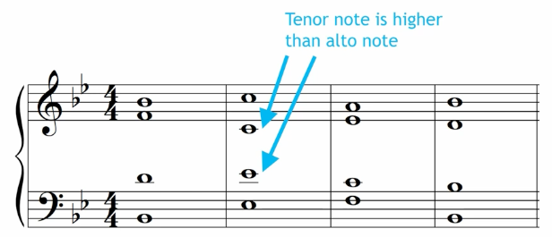
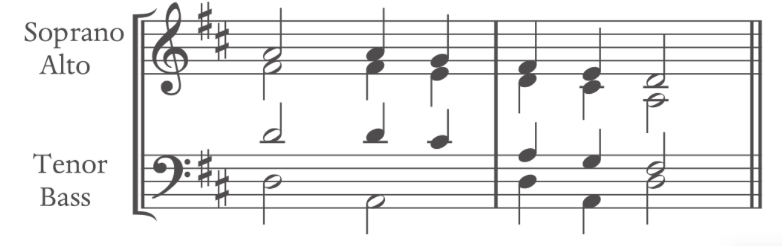
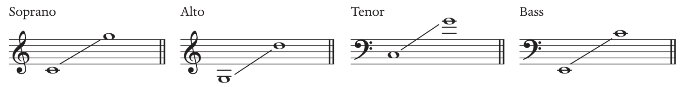
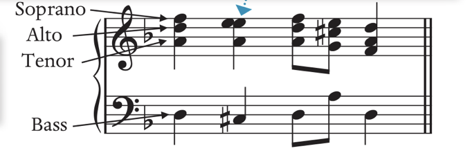
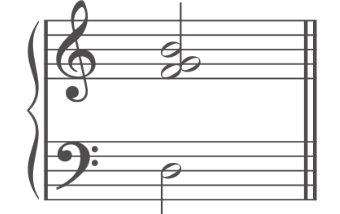
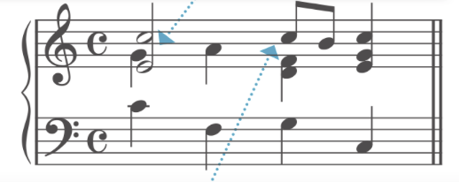

# Some Term Definition
**Chord Skips**: A chord skip occurs when one chord tone skips to another tone within the same harmony.

**Voice Crossing**: Where the lower registration sings higher than higher voices. i.e. Alto sings higher than the Soprano. Hard to tell which part is singing which notes.

**Voice Overlap**: Where the lower registration sings higher than higher voices in the previous chord. i.e. Alto sings higher than the Soprano in the previous chord. Crossing the in next chord.

**Voice Exchange**: When the same note is sung at a different registration.

**Cadences**: Cadences should always be in their root position.

**Syncopation**: A repeating a weak chord to a strong chord. The only exception is that when there is a pickup, they may appear in the weak beat.

**Cadence**: In a cadence, the tonic and dominant chord should be in the root position.

**Diatonic**: uses accidental within the key signature

**Chromatic**: uses accidentals outside of the key signature

**Pivot modulation**: diatonic modulation with overlap, uses a shared chord

**direct modulation**: goes directly into the new key with no overlap

**common-tone**: uses a note as a pivot tones, and there are others.

**Anacrusis**: term for pickup

**Focal Pitch**: Helps explain the music without a specific tonal -> atonality music : central emphasis note: What note is being heard the most often/emphasized

**Pitch class**: all of the note with that name. i.e. G, which includes G1-G6

# Four-part Harmony

## SATB format

## SATB Range

**Avoid each voice** to be an **octave apart**, except the bass
**Avoid voice crossing**: i.e. bass higher than tenor; soprano lower than alto

## Keyboard format

## Stem and Notation 
- The upper of the second is always on the right 
- The stem is the opposite if the rhythm is different
- The top three notes are placed within an octave
- Triad note doubling: usually preferable to the root bass or second inversion bass 

