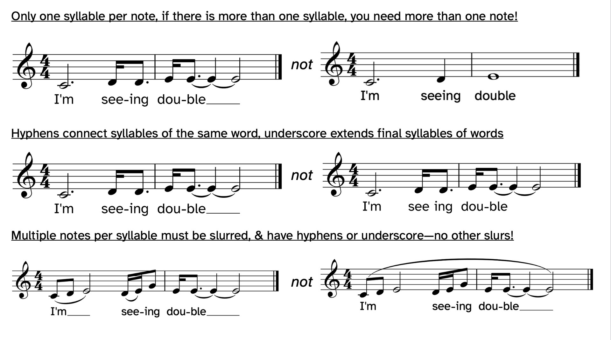
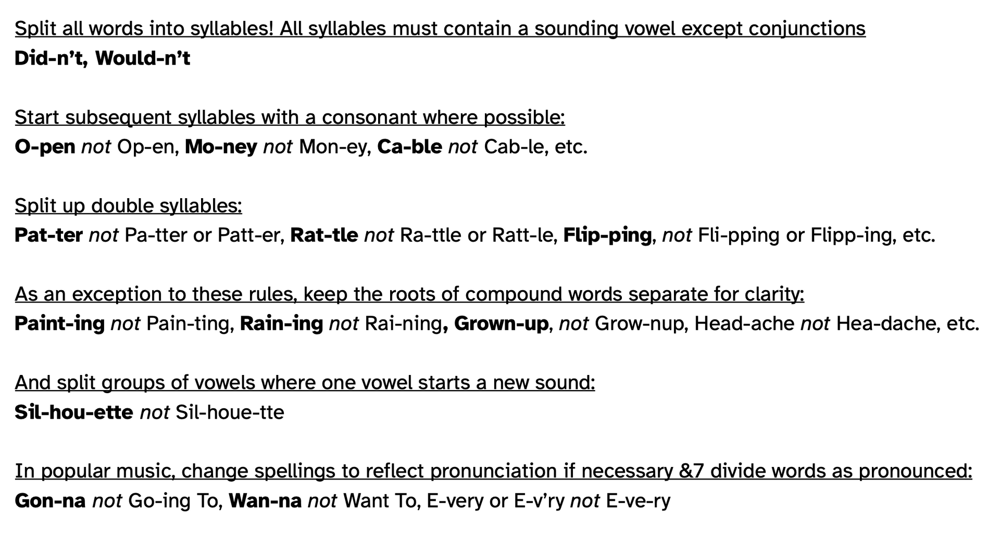
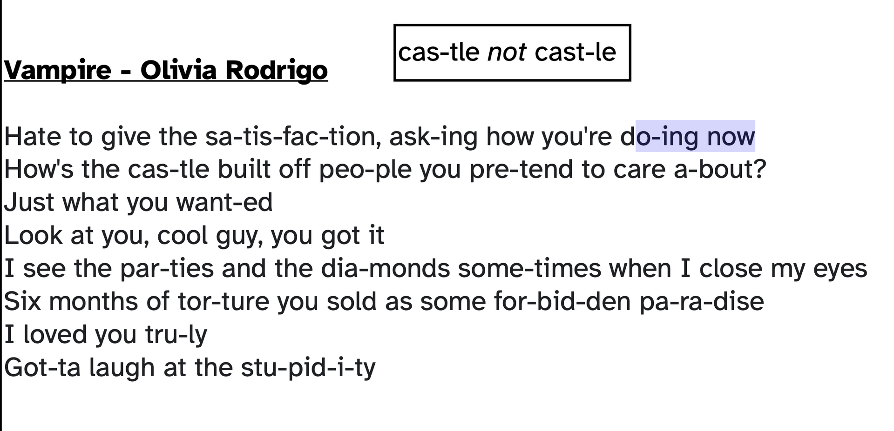

# Lyrics

## For Writing good Lyrics

### No Adjective No Adverbs
 DO NOT ADD ANY ADVERBS OR ADJECTIVE
 "The road to hell is paved with adverbs and adjectives"
 "You don't need to say "The dog barked loudly", Loudly is implied, and adding it actually weakens the bark
  Verbs are way more imporant and they're the power house

### Picture it
Looking for snap shot to show the picture instead of saying it plain
i.e. beautiful, normal Saturday afternoon
use BBQ smoke curling up through the Eucalypyus leaves

### Contrast
sin to angel
burn to cold
add the contract words to lines

### Power position
The first line and last line are usually important
Better gives last line a "surprise" something different (pivot it)

Slurs are only used for multiple note with a syllable

# Writing Lyric

## Text selection and Scantion 
- Selection: Try to find the rhyme of the text, find the meter of the text by singing it with the same pitch.
- Scantion: Pick the most important words/syllables in the text and place them on the down beat.

## Notating Rules
- Dynamic stays on top of the staves
- **One syllable per note**, divide note into rhythm if several syllable in one pitch
- **Double consonant should be split** into oseparate syllables. i.e. hap-py
- **syllable should contain at least one sounding vowel**: silent vowels may not be the only syllable
- **Subsequent syllable must be consonant.** i.e. ca-ble, mo-ney, o-pen
- **Split group of vowels where one vowel starts a new sound.**
- **Keep the compound word separate.** i.e. paint-ing, grown-up
- syllable division with `-`, word separation with `[space]` , word continuation with `_`. Slurs (melisma) commontly used to indicate syllable continuation 
- **Popular music only**: **changing spelling to reflect pronounciation** if necessary. i.e. gon-na instead of going to, E-very or E-v’ry not E-ve-ry

# Musical parameter
- Anything that is instruction that could be told to performer to do in a composition
- Pitch
	- Density (vertical way: lots of pitches happening)
	- Frequency (how high/how low) tessitura (the highest and the lowest of the note you can write for)
	- Melody
	- Harmony
- Rhythm
	- Tempo
	- Duration
	- Density (horizontal way: more rhythmic that is overlapping)
	- Meter: regular pattern of emphasis within a pulse group, mix with predictable strong beat in a series of pulse.
	- Swing
- Organization
	- Texture: how to categorize into layering
	- Structure
	- Repetition
- Quality 
	- Silence
	- Dynamics
	- Accent
	- Timbre (quality of the sound: muffled, noisy, raspy, gritty) (vibrato)
	- Register
- Text
	- Emphasis (Scansion)

- Contour: going up/goindg down
- Motion:
	- Conjunct motion: in steps - Melody moves in step wise
	- Dijunct motion: in skips - Disjunct moves in skips wise

## Melody Attributes
- repetition
- structure/form
- Singable: Range
- Diatonicisim (Tonal harmony)
- Style
- Avoid large leaps (doesn't fit how the human voice behaves)
	- conjunction: in steps
	- disjunction: in leaps
- Moderate speed
	- Too slow doesn't sound like a melody
	- Too fast is not singable
- Dynamic

## Good Melody
### Verse
- Variation: Good melody doesn't always need to come up with new idea, RECYCLE the old idea and make variation out of it the is the main thing.
- Rhythmic: Push and pull, or it will feel very robotic (not on time)
	- Synchopation is very limited (its own genre/style)
	- Rhythmic contour (fast rhythmic at the beginning and end, slow rithmic in the middle)
	- Stretch on certain notes (important words), compress certain notes that are not important
- Structure: stretching and compressing, stretching on a certain melody and compress on certain melody
- Feel free to repeat the same melody: the main way to establish melody is to REPEAT it.
- Use the similar pattern with Transition or Inversion
	- Shift up will give more tensions
### Pre-chorus
- Prechorus: more words and less rythmic
### Chorus
- Chorus: Everything is the reverse and contrasting with verse, repetitive-variation, step-skip, upward-downward, push.pull-on the beat, reverse contour overall
- Feel faster becuase everything is repeathing at one bar.
- Chorus also need contract within contrast (bringing back the scales from the beginning)
- highest note in the melody are usually the most distinct high point (emotion) and are used very sparingly

## Traking Musical Stress
- Hunt for:
	- Leap
	- Duaction
	- Registral
	- Beginning
## Tracking Lyrical Stress
- Lyrics stressed and unstressed
- If stressed happend on the musical note stress, that usually means interlocking melodies

# Accompaniment (Majority apply to pop music)
- The goal of accompaniment:
	- sets the foundation for harmony
		- Choose of harmony is tied to genres
		- popular song does not have to be new for across parameters
		- acceleration can be achieved via change the harmonic bar from 4 bar harmony -> 2 bars harmonic -> 1 bar harmonic
		- slower harmony change usually occurs in 1,2,4,8 bars (good to add interest and variation)
	- give the rhythmic layers
	- give the melodic layers
	- expands the tone colour
	- give different kind of texture
	- define the style and genre
	- define structural change, define musical/dramatic arcs

# Chord pregression
- Royal road progression: IV - V - iii - vi
	- Lots of use in JP song: Royal role progression - 王道进行
	- Has a sense of melodrama
	- Bright and moody
	- gives sence of drama
	- gives sence of emotion
	- IV - V: story telling
	- iii - vi: keep the story rolling
- Creep chord progression: I - III - IV - iv / G - B - C - Cm
	- [More Explanation](https://www.youtube.com/watch?v=NyiEMdbfjG8)
- Minor Axis progression: vi - IV - I - III / Am - F - C - E
	- [More Explanation](https://www.youtube.com/watch?v=LjOKMNNo7HA)
	- Minor version of the famous pop music progression (Which is a major progression: vi - IV - I - V / Am - F - C - G)
	- The E chord is more functional and more direction to get. back to Am
	- Uses the harmonic minor scale in III -> E - G# - B
	- Leading tone G# -> B makes this chord special
	- [More Explanation](https://www.youtube.com/watch?v=LjOKMNNo7HA)
- Oasis progression: I - III - vi - IV
	- Some alternation: I - III - vi - (IV-iv)
	- Some alternation: I - III - ( vi-V) - IV
	- Common pop song progression
	- [More Explanation](https://www.youtube.com/watch?v=mUYgS4IP_TU)
	
# Things to make the songs flowing
## Harmony
- Repetition: Block Chord: Work well with syncopated vocals
- alternation
- arpeggiation
- decoration

- **Repetition** 
	- Block Chord : Add syncopation on melodic line
	- Block Chord & Rhythm: Add syncopation on melodic line
- **Alternation**: A bit like arpegggio, but alternate with notes
- **Arpeggio**: Full arpeggio
- **Riff**: Short musical/rhythmic foundational pattern that may or may not loop throughout the song
- **Decoration**:
	- Adding Syncopation
	- Repetition notes
	- Melody alternation
	- Melody part arp
	- 